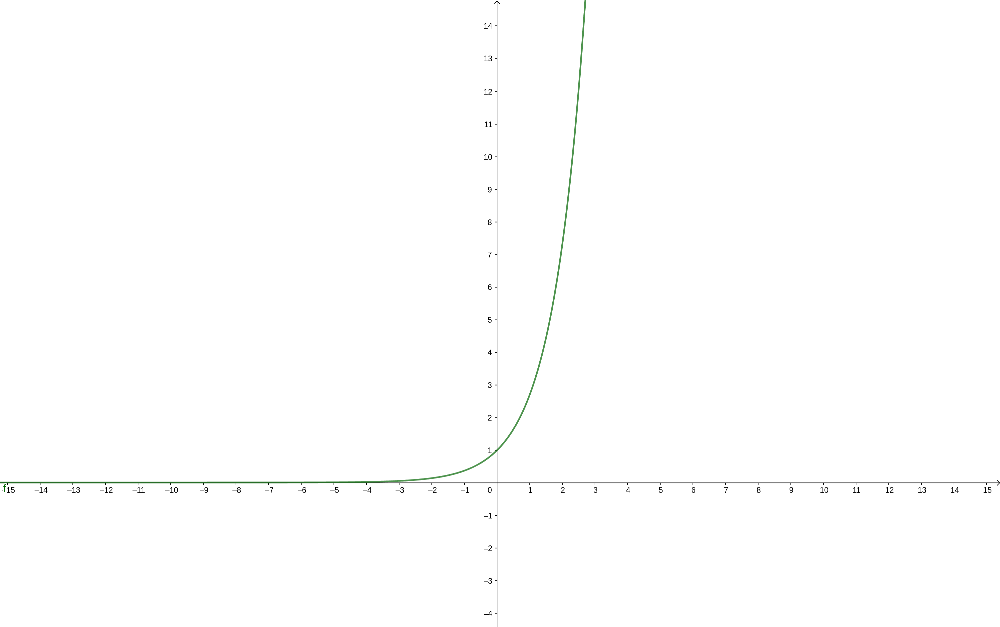
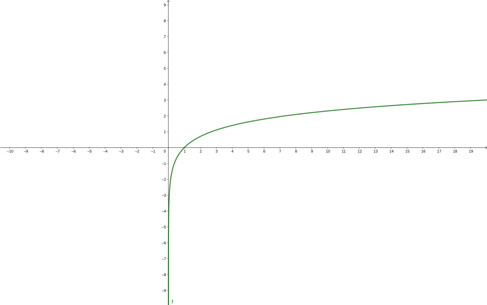

---
title : L'exponentielle et sa copine, le logarithme
author : Fabien Delhomme
lang: fr
date: 3 septembre 2018 
document: report, 12
...

# L'exponentielle

## Motivations

Maintenant que vous connaissez le merveilleux outils qu'est la dérivée, nous
allons étudier deux autres fonctions dont les propriétés sont _indispensables_
en mathématique, et en science en général. 

Ces deux fonctions sont l'exponentielle et le logarithme, qui sont réciproques
l'une de l'autre. Nous reverrons l'exponentielle dans le chapitre des complexes
(en géométrie). 

## Définition

Voici la définition de la fonction exponentielle réelle. C'est une fonction,
notée $\exp$, qui va de $\mathbb{R}$ dans $\mathbb{R}$, telle que :

$$ 
\left\{ 
\begin{array}{lll}
  \forall x \in \mathbb{R} & \exp'{x} & = \exp{x} \\
   & \exp{0} & = 1
\end{array}
\right.
$$

## Propriétés de l'exponentielle

À cause de sa définition, l'exponentielle admet plusieurs propriétés. 

  - Elle n'est jamais nulle, 
  - elle est toujours strictement positive,
  - elle est toujours croissante,
  - Sa limite en plus l'infini vaut l'infini
  - Sa limite en moins l'infini vaut 0
  - Elle se comporte comme une fonction puissance (voir le paragraphe du
      dessous), à cause de sa propriété : $\exp{x+y}= \exp{x}*\exp{y}$.

De plus, on $\exp{1} = \mathrm{e}$. C'est un nombre que l'on peut calculer, et
qui donne d'après la calculatrice (ou google !) $\approx 2.71828182846$

**Lien entre l'exponentielle est les fonctions puissance**

La formule $\exp{x+y}= \exp{x}*\exp{y}$ fait écho avec la formule $a^{x+y} =
a^{x}*a^{y}$. C'est pour cela que l'on note :

  $$ \exp{x} = \mathrm{e}^x $$

Donc, calculer $\exp{x}$ revient à calculer $\mathrm{e}$ _puissance_ $x$.

**Exemple de calcul :** on sait que $\exp{\frac{1}{2}}$ est plus petit que
$\exp{1}$, mais plus grand que $\exp{0} = 1$ donc $\exp{\frac{1}{2}} > 0$
puisque la fonction exponentielle est croissante. De plus,

  $$ \left(\exp{\frac{1}{2}}\right)^2 = \exp{\frac{1}{2}}*\exp{\frac{1}{2}} = \exp{\left(\frac{1}{2} + \frac{1}{2}\right)} = \exp{1} = \mathrm{e}$$

Or, le nombre $\exp{\frac{1}{2}} > 0$, donc :

  $$\exp{\frac{1}{2}} = \sqrt{ \mathrm{e}}$$

Jetez un coup d'œil à la figure \ref{exp} la croissance extraordinaire de cette
fonction lorsque $x$ devient de plus en plus grand ! Graphiquement, on peut
retenir :

  - Les limites de l'exponentielle en plus et moins l'infini
  - Sa propriété de croissance sur tout $\mathbb{R}$
  - Sa propriété de positivité sur tout $\mathbb{R}$

# Le logarithme

## Définition

Dans cette partie, je vais vous montrer que le logarithme est la fonction
réciproque de la fonction exponentielle. Tout comme pour la fonction racine
carrée, définir une réciproque est toujours un peu délicat, ou tout du moins, il
faut faire attention au domaine de définition de cette fameuse réciproque.

Reprenons quelques propriétés de l'exponentielle pour définir proprement le
domaine de définition de la fonction réciproque, le logarithme. On a vu dans la
partie précédente que l'exponentielle était définie pour toutes les valeurs de
$\mathbb{R}$ et que pour tout $x$ dans $\mathbb{R}$, $\exp{x} > 0$. Donc, on
peut résumer cela par :
  $$ \exp \mathbb{R} \longrightarrow \mathbb{R}^{*+}$$
Où la notation $\mathbb{R}^{*+}$ désigne que les réels strictement positifs.

De plus, l'exponentielle est **strictement** croissante sur $\mathbb{R}$. Donc,
si l'on veut résoudre l'équation :

  $$ \exp{x} = y $$

(Qu'il faut lire « Quel est le x tel que, pour un y donné, $\exp{x} = y$ ? ») il
y aura :

  - Soit une unique solution si $y > 0$ (l'unicité est garantie par la stricte
      croissance, l'existence par le TVI, à cause des limites de l'exponentielle
      en $-\infty$ et $+\infty$)
  - Soit aucune solution si $y \leq 0$. 

Donc, dans le cas où $y >0$, on peut définir une fonction, que l'on appelle le
logarithme, qui répond à la question posée plus haut, « Quel est le x tel que,
pour un y donné, $\exp{x} = y$ ? ». On pose donc, pour $y <0$ :

  $$ \ln{y} = x = \text{l'unique réel tel que} \ \exp{x} = y $$

Quelques remarques :
  
  - Pour l'instant, nous n'avons aucune formule pour calculer le logarithme !
  - Cette définition est essentielle si vous voulez comprendre le logarithme.
  - Faites bien attention au domaine de définition du logarithme.

On récapitule, on vient donc de définir une fonction, nommée logarithme, qui est
définie sur $\mathbb{R}^{*+}$, à valeur dans $\mathbb{R}$. Résumé autrement : 
\begin{align*}
  \exp : \ \mathbb{R} \longrightarrow      &\mathbb{R}^{*+} \\
           \mathbb{R} \longleftarrow &\mathbb{R}^{*+}:\  \ln
\end{align*}

## Exemples 

Quelques exemples pour bien comprendre. 

  - Puisque que $\exp{0} = 1$, alors, $\ln{1} = 0$. 
  - Si je cherche le nombre $x$ tel que $\exp{x} = 3$, alors je tape sur la
      calculatrice (qui connait son logarithme !) $\ln{3}$.

## Propriété du logarithme 

### Graphe du logarithme

Pour obtenir le graphe du logarithme, on procède de la même manière que
lorsqu'on voulait obtenir le graphe de la fonction racine carré sachant le
graphe de la fonction racine ! Mathématiquement, on prend la courbe symétrique à
l'axe $y=x$ de la courbe exponentielle pour obtenir celle du logarithme.

Sinon, reportez vous au graphe donné par votre calculatrice, ou à la figure
\ref{log}. Amusez vous à regarder la courbe de l'exponentielle **et** du
logarithme sur le même graphique, pour voir la symétrie apparaître !

### Produit en somme

Toutes les propriétés du logarithme viennent de celles de l'exponentielle ! Par
exemple, puisque :
  $$ \exp{x + y} = \exp{x} * \exp{y} $$

On a donc[^détail], en passant au logarithme $$ \ln{a*b} = \ln{a} + \ln{b}$$. Alors que
l'exponentielle transforme une somme en produit, le logarithme fait l'opération
inverse, en transformant un produit en somme ! Comme l'exponentielle, c'est
cette propriété qui est très recherchée en pratique !

Un petit exemple ? Et bien :

  $$\ln(6) = \ln(2*3) = \ln(2) + \ln(3)$$

#### La puissance et le logarithme

Comme l'exponentielle c'est un peu la fonction «puissance», on peut voir le
logarithme comme «l'anti-puissance». Cela est résumé par la propriété suivante :
  $$\ln{a^p} = p \ln{a}$$
Pour tout $a, p$ deux réels strictement positifs.

Un petit exemple ?

  $$\ln{\sqrt{2}} = \ln{2^{\frac{1}{2}}} = \frac{1}{2} \ln{2}$$

Nous verrons par exemple comment trouver directement un nombre $p$ tel que
$2^{p} = 1024$. Cela sera très utile pour (au moins) deux notions :

  - Pour les suites, pour savoir à quel moment elle dépasse un seuil donné 
  - Pour l'algorithmie, par exemple pour exprimer le nombre d'opérations
      nécessaires pour trouver un nombre dans une liste de 1024[^exp] nombres.

[^exp]: c'est un exemple ! On pourra remplacer 1024 par n'importe quel nombre.
[^détail]: pour une démonstration détaillée, n'hésitez pas à demander !

### Limites

De même, on peut calculer les limites du logarithme :

  - $\lim_{x \to 0} \ln{x} = - \infty$
  - $\lim_{x \to +\infty} \ln{x} = + \infty$

Dans le même ordre d'idée, la fonction logarithme est _indéfiniment dérivable_
(comme la fonction exponentielle) **sur son domaine de définition**.

Mais, question légitime, si la fonction logarithme est dérivable, que vaut sa
dérivée ?

### Dérivée de la fonction logarithme

La fonction logarithme est dérivable sur $\mathbb{R}^{+*}$, et sa dérivée vaut
(accrochez vous bien !) :

  $$\ln'{x} = \frac{1}{x} \quad \text{pour tout } x \in \mathbb{R}^{+*}$$

Et par la formule d'une dérivée composée, on trouve que si on a une fonction $u$
qui est **strictement positive** pour tout $x$ sur le domaine de définition de
$u$, alors :

  $$ (\ln \circ u)' = \frac{u'}{u}$$

**Exemple:** soit la fonction $f(x) = \ln{(x^2 +1)}$. La fonction $x \mapsto x^2 +1$
est strictement positive sur $\mathbb{R}$, alors la fonction $f$ est définie sur
$\mathbb{R}$, et est dérivable sur $\mathbb{R}$. Sa dérivée vaut :
  $$f'(x) = \frac{2x}{x^2+1}$$
