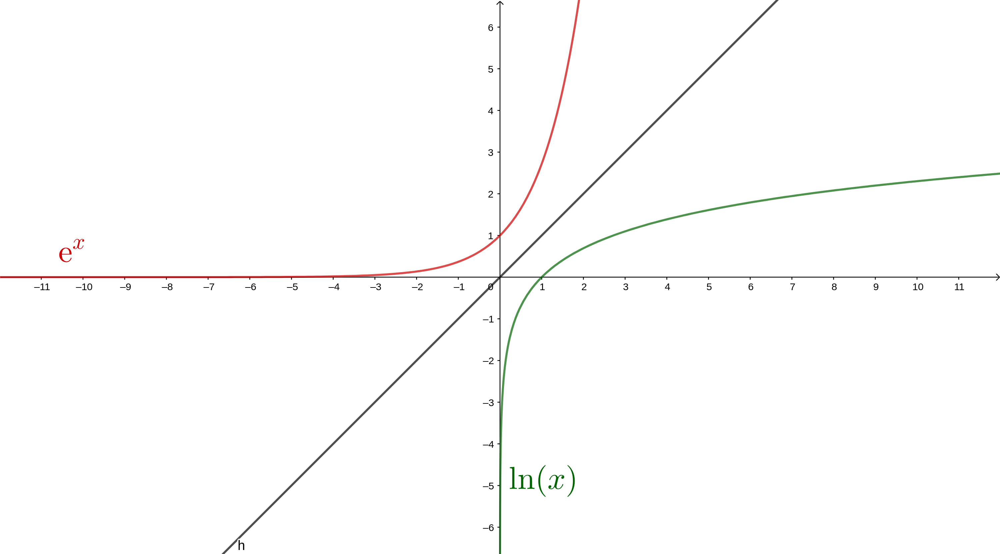

# L'exponentielle

## Motivations

Maintenant que vous connaissez le merveilleux outils qu'est la dérivée, nous
allons étudier deux autres fonctions dont les propriétés sont _indispensables_
en mathématique, et en science en général.

Ces deux fonctions sont l'exponentielle et le logarithme, qui sont réciproques
l'une de l'autre. Nous reverrons l'exponentielle dans le chapitre des complexes
(en géométrie).

## Définition

La définition de la fonction exponentielle est difficile. En plus, comme souvent
en mathématiques, il existe plusieurs moyens de définir cette fonction. Ces
différentes définitions désignent évidement le même objet, mais sont de natures
assez différentes. Je vais maintenant vous présenter trois définitions de la
fonctions exponentielles. Elles sont toutes admises (vous comprendrez pourquoi
dans les paragraphes suivants), et seulement les deux premières sont au
programme du bac, la troisième servant de culture générale, et me servira au
chapitre sur les complexes pour vous convaincre que la fonction exponentielle
peut aussi se définir pour des nombres complexes !

### Définition par une équation différentielle

Voici la première définition de la fonction exponentielle réelle. C'est une
fonction, notée $\exp$, qui va de $\mathbb{R}$ dans $\mathbb{R}$, telle que :
$$
\left\{
\begin{array}{lll}
  \forall x \in \mathbb{R} & \exp'{x} & = \exp{x} \\
   & \exp{0} & = 1
\end{array}
\right.
$$

On dit que c'est une _équation différentielle_ parce que c'est une équation dans
laquelle l'inconnue est une fonction, et l'équation fait apparaitre les
dérivées de la fonction.

À notre niveau, on admet qu'une telle fonction existe, et qu'elle est définie
sur $\mathbb{R}$. Il existe des moyens pas très compliqués pour le prouver, ils
sont néanmoins abordés en toute rigueur en licence de mathématique. Une
démonstration élémentaire s'appuie sur la méthode d'Euler, une méthode que l'on
explore dans le cas de la fonction exponentielle dans la partie suivante.

### Définition par une équation fonctionnelle

L'équation fonctionnelle respectée par l'exponentielle est la suivante :
$$ \text{Pour tout } x, y \in \mathbb{R} \ \exp(x) * \exp(y) = \exp(x +y)$$

De la même manière, nous allons admettre que cette équation n'est vérifiée que
par une seule fonction, et donc que cela nous donne bien une définition, et
qu'elle est équivalente à la définition précédente (c'est-à-dire que dans les
deux cas, on parle de la même fonction).

On dit que c'est une _équation fonctionnelle_ parce que c'est une équation dans
laquelle l'inconnue est une fonction, et implique une égalité entre plusieurs
termes qui correspondent à plusieurs évaluations de la fonction en différents
points. Les équations fonctionnelles sont plus difficiles à étudier, et en
général ne sont abordés qu'en master. Dans le cas de l'exponentielle néanmoins,
cette équation est simple à vérifier, et cette vérification s'effectue en
deuxième année de licence de mathématique.

### Définition par une somme infinie

Oui, vous avez bien lu, une somme infinie ! Évidemment, vous n'avez pas assez de
baguage mathématiques pour que je puisse vous définir proprement ce que
signifie, et dans quel sens on peut parler tel objet, une somme infinie. Mais
tout ce que vous pouvez savoir, c'est que cette formule permet de définir
l'exponentielle sur beaucoup d'autres ensembles que les réels (par exemple les
complexes, mais aussi les matrices etc..). Sans plus attendre, voici la
définition.
$$ \exp(x) = \sum_{k=0}^{\infty} \frac{x^k}{k!} = 1 + x + \frac{x^2}{2} +
\frac{x^3}{6} + \ldots$$

Ici $k!$ signifie que l'on calcule $k*(k-1)*(k-2)*\ldots*1$. Par exemple $5!$,
qui se lit «$5$ factoriel» se calcule par $5!= 5*4*3*2*1 = 120$. Nous
retrouverons cette notation en probabilité.

Pareil, cette formule est vue en pratique en première année de licence de
mathématiques. C'est souvent par elle d'ailleurs que l'on commence par
introduire la notion d'exponentielle, et que l'on démontre les autres
définitions (soit une démarche totalement inverse que celle du bac).

### Commentaires sur ces définitions

Les deux premières définitions sont _essentielles_ pour le programme du bac, car
elles servent _tout le temps_. Par exemple pour dériver une fonction qui est
composée d'exponentielles, ou alors pour résoudre des équations simples etc. 

La troisième n'est absolument pas à citer au bac ! C'est-à-dire que vous devrez
_jamais_ écrire que $\exp(x) = \sum_{k=0}^{\infty} \frac{x^k}{k!}$ pour un
exercice au bac, même si cela est parfaitement valide du point de vue
mathématique.

Néanmoins, vous voyez ici une formule qui permet de _calculer_ l'exponentielle !
Par exemple, essayer de comparer à la calculatrice $\exp(1)$ et $1 + 1 +
\frac{1}{2} + \frac{1}{6} + \frac{1}{24} + \frac{1}{120}$ qui correspondent au
cinq premiers termes de la somme infinie citée plus haut.

## Propriétés de l'exponentielle

Voyons maintenant les propriétés de l'exponentielle. Mais avant, regardez
attentivement le graphe de cette fonction, et vérifiez que chaque propriété se
retrouve graphiquement à l'aide de la courbe de l'exponentielle.

{ width=15cm}

### Propriétés conséquentes de la définition

En combinant les deux premières définitions (l'équation différentielle et
l'équation fonctionnelle), nous pouvons avoir les premières définitions de la
fonction exponentielle

#### Stricte positivité 

L'exponentielle n'est jamais nulle, en effet, pour tout $x \in \mathbb{R}$, nous
avons :
$$ \exp{(x)}*\exp{(-x)}=\exp{(x-x)}=\exp{(0)}$$
Donc, pour tout $\exp{x}$ admet _un inverse_, donc nécessairement n'est pas nul.

Maintenant, nous pouvons montrer que la fonction exponentielle est en fait
positive, en effet, pour tout $x \in \mathbb{R}$ :
  $$ \exp(x) = \exp{\left(2\frac{x}{2}\right)} = \exp{\left(\frac{x}{2} + \frac{x}{2}\right)} =
  \exp{\frac{x}{2}}*\exp{\frac{x}{2}} = \left(\exp{\frac{x}{2}}\right)^2$$

Donc, puisque qu'un carré est toujours positif dans $\mathbb{R}$, le nombre
$\exp{x}$ est toujours positif, et ceci quel que soit le $x \in \mathbb{R}$ pris
au départ. Donc la fonction est positive sur tout $\mathbb{R}$.

Finalement, nous avons montré que la fonction exponentielle est strictement
positive sur $\mathbb{R}$.

#### Stricte croissance 

Donc, grâce à la première propriété, nous savons que l'exponentielle est sa
propre dérivée, donc vu que l'on vient de voir qu'elle est strictement positive,
alors on peut en conclure que l'exponentielle est strictement croissante sur
$\mathbb{R}$.

#### Lien entre l'exponentielle est les fonctions puissance

La formule de l'équation fonctionnelle $\exp{x+y}= \exp{x}*\exp{y}$ fait écho
avec la formule $a^{x+y} = a^{x}*a^{y}$. C'est pour cela que l'on note :
  $$ \exp{x} = \mathrm{e}^x $$

Donc, calculer $\exp{x}$ revient à calculer $\mathrm{e}$ _puissance_ $x$, avec
$\mathrm{e}$ un nombre réel qui vaut[^def] $\exp(1)$.

[^def]: c'est une définition

En fait, on peut même _définir_ comment élever un nombre $a$ a la puissance $x$
pour tout $x \in \mathbb{R}$. Ceci sera fait dans le paragraphe de la fonction
logarithme.

### Exemples de calcul :

On sait que $\exp{\frac{1}{2}}$ est plus petit que $\exp{1}$, mais plus grand
que $\exp{0} = 1$ donc $\exp{\frac{1}{2}} > 0$ puisque la fonction exponentielle
est croissante. De plus, 
  $$ \left(\exp{\frac{1}{2}}\right)^2 = \exp{\frac{1}{2}}*\exp{\frac{1}{2}} =
  \exp{\left(\frac{1}{2} + \frac{1}{2}\right)} = \exp{1} = \mathrm{e}$$

Or, le nombre $\exp{\frac{1}{2}} > 0$, donc :
  $$\exp{\frac{1}{2}} = \sqrt{ \mathrm{e}}$$

Jetez un coup d'œil à la figure \ref{exp} la croissance extraordinaire de cette
fonction lorsque $x$ devient de plus en plus grand ! Graphiquement, on peut
retenir :

  - Les limites de l'exponentielle en plus et moins l'infini
  - Sa propriété de croissance sur tout $\mathbb{R}$
  - Sa propriété de positivité sur tout $\mathbb{R}$

## Calculs de limites

### Limites en plus et moins l'infini

Puisque l'exponentielle est sa propre dérivée, on peut se convaincre que plus
elle croit, plus en va croitre vite, et donc va très rapidement vers $+\infty$.
Finalement, on obtient :
  $$ \lim_{x \to \infty} e^{x}= \infty$$

De même, avec un peu de réflexion[^exo], on peut se convaincre que :
  $$ \lim_{x \to -\infty} e^{x}= 0$$

Ce sont des limites qu'il faut connaitre pour le bac.

[^exo]: c'est un exercice !

### Formes indéterminées avec l'exponentielle

Il arrive très fréquemment au bac que l'on vous demande de calculer des limites
faisant apparaître des exponentielles. Souvent, ce sera des formes
indéterminées. Il en existe deux types.

#### Résolution par la définition de la dérivation

Nous pouvons, par définition de la dérivation, calculer la limite de :
  $$ \lim_{x \to 0} \frac{e^x - 1}{x}$$

C'est une forme indéterminée, du type «$\frac{0}{0}$», et pour lever cette
indétermination, il faut voir que c'est simplement le nombre qui correspond à
la dérivée de la fonction exponentielle en $0$ :
  $$\lim_{x \to 0} \frac{e^x - 1}{x} =\lim_{x \to 0} \frac{ e^x - e^0}{x - 0} = \exp'{0} = \exp(0)= 1$$

Ce calcul de limite est plutôt «rare» au bac. 

#### Résolution par croissance comparée

Un type de limite plus fréquent à calculer, et la croissance comparée. En effet,
on peut montrer que quelque soit la puissance $k \in \mathbb{R}$ de $x$, alors
l'exponentielle l'emportera sur la puissance de $x$. Que ce soit en plus
l'infini ou en moins l'infini. Mathématiquement parlant, cela donne, pour tout
$k \in \mathbb{R^{+}}$.
  $$\lim_{x \to \infty} \ x^k*e^{-x} = 0$$ 
Et,
  $$\lim_{x \to \infty} \ \frac{e^x}{x^k} = \infty$$

Ce qu'il faut retenir c'est que «l'exponentielle l'emporte devant n'importe
quelle puissance de $x$».

# Le logarithme

## Définition

Dans cette partie, je vais vous montrer que le logarithme est la fonction
réciproque de la fonction exponentielle. Tout comme pour la fonction racine
carrée, définir une réciproque est toujours un peu délicat, ou tout du moins, il
faut faire attention au domaine de définition de cette fameuse réciproque.

Reprenons quelques propriétés de l'exponentielle pour définir proprement le
domaine de définition de la fonction réciproque, le logarithme. On a vu dans la
partie précédente que l'exponentielle était définie pour toutes les valeurs de
$\mathbb{R}$ et que pour tout $x$ dans $\mathbb{R}$, $\exp{x} > 0$. Donc, on
peut résumer cela par :
  $$ \exp \mathbb{R} \longrightarrow \mathbb{R}^{*+}$$
Où la notation $\mathbb{R}^{*+}$ désigne que les réels strictement positifs.

De plus, l'exponentielle est **strictement** croissante sur $\mathbb{R}$. Donc,
si l'on veut résoudre l'équation :
  $$ \exp{x} = y $$

(Qu'il faut lire « Quel est le x tel que, pour un y donné, $\exp{x} = y$ ? ») il
y aura :

  - Soit une unique solution si $y > 0$ (l'unicité est garantie par la stricte
      croissance, l'existence par le théorème des valeurs intermédiaires, à
      cause des limites de l'exponentielle en $-\infty$ et $+\infty$)
  - Soit aucune solution si $y \leq 0$.

Donc, dans le cas où $y >0$, on peut définir une fonction, que l'on appelle le
logarithme, qui répond à la question posée plus haut, « Quel est le x tel que,
pour un y donné, $\exp{x} = y$ ? ». On pose donc, pour $y <0$ :
  $$ \ln{y} = x = \text{l'unique réel tel que} \ \exp{x} = y $$

Quelques remarques :

  - Pour l'instant, nous n'avons aucune formule pour calculer le logarithme !
  - Cette définition est essentielle si vous voulez comprendre le logarithme.
  - Faites bien attention au domaine de définition du logarithme.

On récapitule, on vient donc de définir une fonction, nommée logarithme, qui est
définie sur $\mathbb{R}^{*+}$, à valeur dans $\mathbb{R}$. Résumé autrement :

\begin{align*}
  \exp : \ \mathbb{R} \longrightarrow      &\mathbb{R}^{*+} \\
           \mathbb{R} \longleftarrow &\mathbb{R}^{*+}:\  \ln
\end{align*}

## Exemples

Quelques exemples pour bien comprendre.

  - Puisque que $\exp{0} = 1$, alors, $\ln{1} = 0$.
  - Si je cherche le nombre $x$ tel que $\exp{x} = 3$, alors je tape sur la
      calculatrice (qui connait son logarithme !) $\ln{3}$.

## Propriété du logarithme

### Graphe du logarithme

Pour obtenir le graphe du logarithme, on procède de la même manière que
lorsqu'on voulait obtenir le graphe de la fonction racine carré sachant le
graphe de la fonction racine ! Mathématiquement, on prend la courbe symétrique à
l'axe $y=x$ de la courbe exponentielle pour obtenir celle du logarithme.

Sinon, reportez vous au graphe donné par votre calculatrice, ou à la figure
\ref{log}. Le graphe suivant montre la fonction exponentielle et la fonction
logarithme sur le même graphique, ce qui permet de mettre en évidence la
symétrie des courbes représentatives autour de l'axe $y=x$ des deux fonctions,
ce qui est due à la définition du logarithme comme réciproque de la fonction
exponentielle.

{ width=15cm}

{ width=15cm}

### Produit en somme

Toutes les propriétés du logarithme viennent de celles de l'exponentielle ! Par
exemple, puisque :
  $$ \exp{x + y} = \exp{x} * \exp{y} $$

On a donc[^détail], en passant au logarithme $$ \ln{a*b} = \ln{a} + \ln{b}$$. Alors que
l'exponentielle transforme une somme en produit, le logarithme fait l'opération
inverse, en transformant un produit en somme ! Comme l'exponentielle, c'est
cette propriété qui est très recherchée en pratique !

Un petit exemple ? Et bien :

  $$\ln(6) = \ln(2*3) = \ln(2) + \ln(3)$$

#### La puissance et le logarithme

Comme l'exponentielle c'est un peu la fonction «puissance», on peut voir le
logarithme comme «l'anti-puissance». Cela est résumé par la propriété suivante :
  $$\ln{a^p} = p \ln{a}$$
Pour tout $a, p$ deux réels strictement positifs.

Un petit exemple ?

  $$\ln{\sqrt{2}} = \ln{2^{\frac{1}{2}}} = \frac{1}{2} \ln{2}$$

Nous verrons par exemple comment trouver directement un nombre $p$ tel que
$2^{p} = 1024$. Cela sera très utile pour (au moins) deux notions :

  - Pour les suites, pour savoir à quel moment elle dépasse un seuil donné
  - Pour l'algorithmie, par exemple pour exprimer le nombre d'opérations
      nécessaires pour trouver un nombre dans une liste de 1024[^exp] nombres.

[^exp]: c'est un exemple ! On pourra remplacer 1024 par n'importe quel nombre.
[^détail]: pour une démonstration détaillée, n'hésitez pas à demander !

### Limites

De même, on peut calculer les limites du logarithme :

  - $\lim_{x \to 0} \ln{x} = - \infty$
  - $\lim_{x \to +\infty} \ln{x} = + \infty$

Dans le même ordre d'idée, la fonction logarithme est _indéfiniment dérivable_
(comme la fonction exponentielle) **sur son domaine de définition**.

Mais, question légitime, si la fonction logarithme est dérivable, que vaut sa
dérivée ?

### Dérivée de la fonction logarithme

La fonction logarithme est dérivable sur $\mathbb{R}^{+*}$, et sa dérivée vaut
(accrochez vous bien !) :

  $$\ln'{x} = \frac{1}{x} \quad \text{pour tout } x \in \mathbb{R}^{+*}$$

Et par la formule d'une dérivée composée, on trouve que si on a une fonction $u$
qui est **strictement positive** pour tout $x$ sur le domaine de définition de
$u$, alors :

  $$ (\ln \circ u)' = \frac{u'}{u}$$

**Exemple:** soit la fonction $f(x) = \ln{(x^2 +1)}$. La fonction $x \mapsto x^2 +1$
est strictement positive sur $\mathbb{R}$, alors la fonction $f$ est définie sur
$\mathbb{R}$, et est dérivable sur $\mathbb{R}$. Sa dérivée vaut :
  $$f'(x) = \frac{2x}{x^2+1}$$
