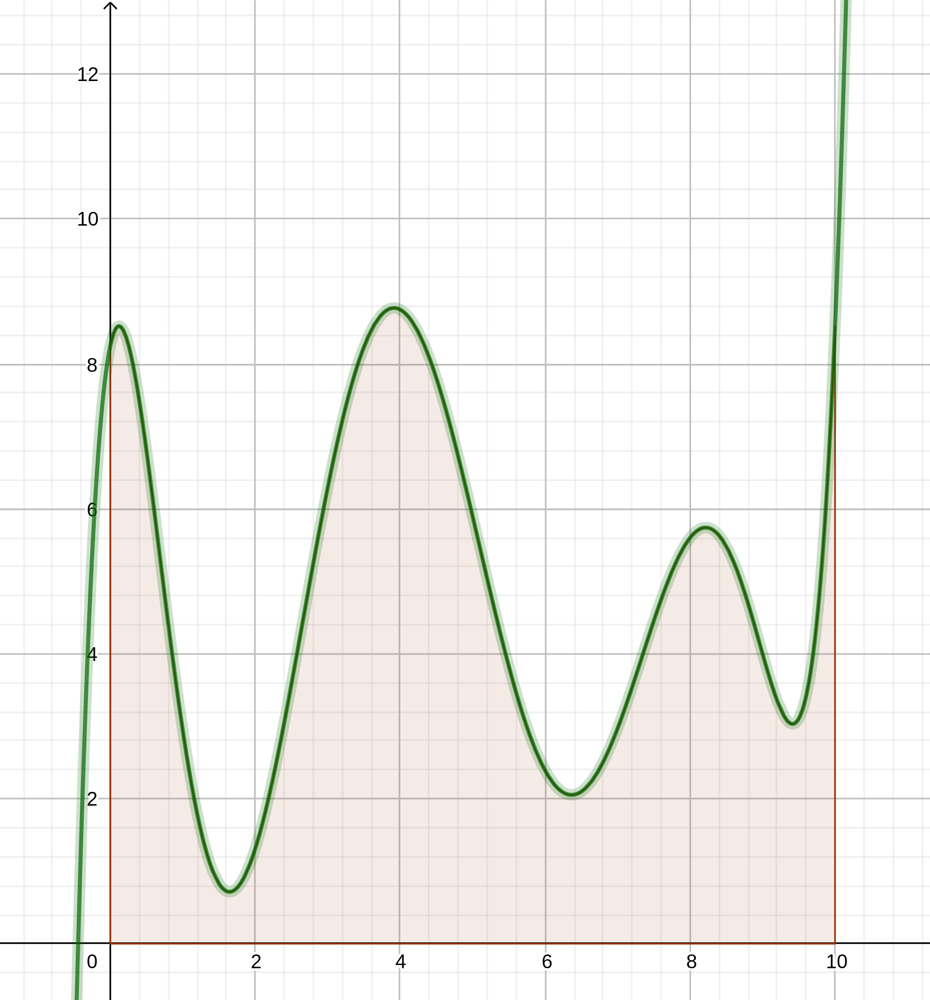
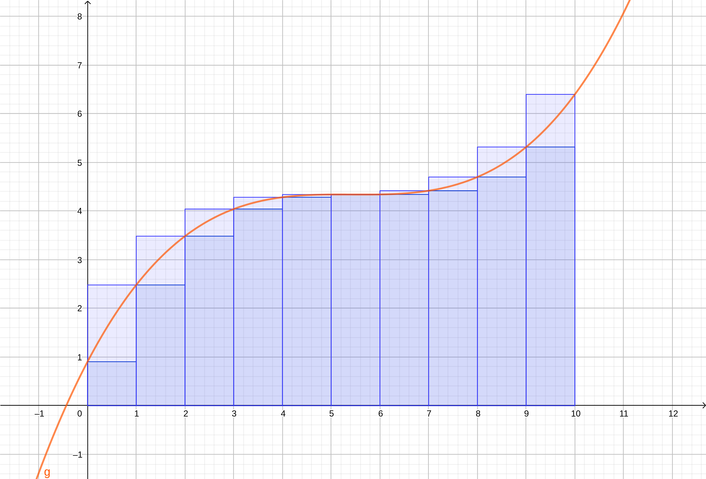
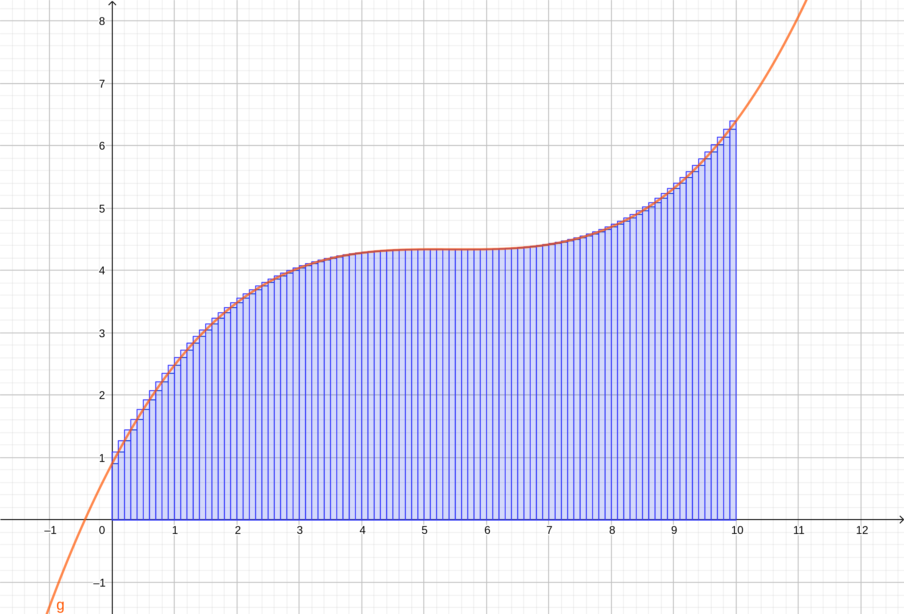
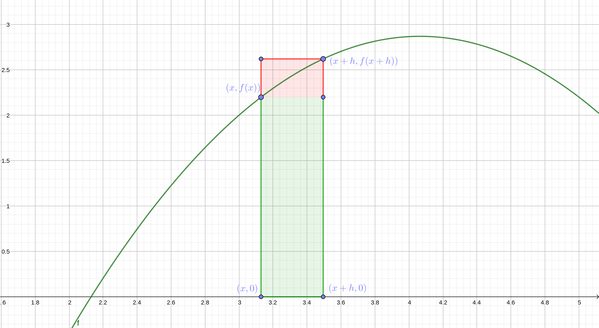

# Motivation

Ce cour présente le dernier outil de l'arsenal du mathématicien, et il s'agit,
avec la dérivée, d'un des outils sans doute les plus puissants : l'intégration.
Là encore, ce procédé est utilisé _dans quasiment toutes les sciences_ comme la
physique, la chimie, mais aussi l'économie, l'ingénierie et bien bien d'autres
encore.

Un mot sur le concept d'intégration en mathématiques. Vous apprendrez ici ce
qu'on appelle l'intégration de Riemann. Pour une multitude de raisons, cette
manière d'intégrer n'est pas très efficace (mais cela va être suffisamment
puissant pour nous !). C'est pourquoi en troisième année de licence vous serez
sensibilisé (si vous suivez un cursus universitaire) à une autre définition de
l'intégration, plus générale et abstraite, l'intégration de Lesbegue. Pour ceux
d'entre vous qui continue à faire des maths, sachez que le _principe_ est
presque le même, donc concentrez vous sur la démarche de la définition de
l'intégrale, votre apprentissage n'en sera que facilité.

Tout commence par une question assez simpliste au premier abord : comment
calculer l'aire sous la courbe d'une fonction positive ?

C'est-à-dire, regardez la figure \ref{fctcompliquee}, comment calculer l'aire nommée
$I$ pour une fonction $f$ qui est définie entre $a$ et $b$ deux nombres réels ?

{ height=30% width=60% }

Nous verrons que cette question a des liens très profond avec la notion de
dérivation, et qu'elle permet aussi (entre autre) d'approximer des fonctions
comme les fonctions trigonométriques, exponentielle, ou logarithmique.

Enfin, beaucoup (si ce n'est tous) d'énoncé au bac portent sur ces fameuses
_intégrales_.

# Définition

## Contexte

On souhaite donc définir **l'aire sous la courbe d'une fonction**. C'est
littéralement le but premier de l'intégration. 

Pour plus de simplicité, nous allons d'abord considéré uniquement dans les
premières propositions, les fonctions $f : I \to \mathbb{R}$ qui sont positive
et continue sur $I=[a,b]$ où $a,b \in \mathbb{R}$. Nous verrons comment étendre
ce cas à d'autres fonctions (par exemple des fonctions négatives). Dans les
années supérieure d'étude, vous verrez comment définir l'intégrale d'une
fonction qui n'est pas forcément continue, ou encore qui admet des valeurs
complexes. Tout cela est pour l'instant trop compliqué pour nous, et nous nous
restreignons aux fonctions continues et réelles. Pour les preuves des théorèmes
fondamentaux de l'intégration, nous présenterons uniquement le cas où la
fonction est de plus positives (voire même croissante).

Même pour cette classe de fonction, le problème, c'est qu'il n'existe pas
vraiment de formule toute faite pour donner exactement l'aire sous la courbe
d'une fonction. La preuve, si vous regarder la figure \ref{fctcompliquee}, vous
pouvez vous convaincre qu'il est très difficile, si on imagine une fonction qui
varie beaucoup, de définir la notion d'aire sous la courbe. 

Dans le reste du paragraphe je vous présente les principales idées qui
permettent de définir proprement l'intégration. Je vous conseille de lire cela
en _deuxième lecture_. Ceci n'est pas vraiment au programme du bac, mais
néanmoins vous _devez_ comprendre les grandes lignes. Un bon test pour savoir si
vous avez compris, est le suivant : êtes vous, après la lecture de ce cours,
capable d'écrire un algorithme qui calcule l'aire d'une fonction continue entre
$[a,b]$ avec une précision de $10^{-1}$ ?

Voici donc une démarche, fondamentale en mathématiques, pour définir certaine
notion en analyse, comme l'intégration :

  - En premier, définir la notion que l'on souhaite sur une classe de fonction
      restreinte, où l'on peut définir facilement cette fonction
  - Deuxièmement, étendre cette définition à toutes les autres fonctions que
      l'on peut _approximer_ au moyen de la définition suivante. 

## Première étape : calculer l'aire sous la courbe de fonctions constantes

Pour la première étape, considérons l'ensemble des fonctions constantes définie
sur un intervalle $[a, b]$, avec $a$ et $b$ des nombres réels. Il est très
facile de calculer l'aire sous la courbe de telle fonction.

<!-- Inclure schéma de l'aire sous la courbe d'une fonction constante-->

Vous pouvez vous convaincre que c'est exactement l'aire d'un _rectangle_, et il
suffit de multiplier la largeur par la longueur pour obtenir l'aire sous la
courbe. Notons $\int_a^b f(t)dt$ l'aire sous la courbe d'une fonction $f$ sur
l'intervalle $[a, b]$.

On aboutit donc à la formule suivante, qui est donc valide uniquement pour des
_fonctions constantes sur l'intervalle_ $[a, b]$ :
$$ \int_a^b f(t)dt = f(a)(b-a) = f(b)(b-a)$$
En effet, $f$ est constante sur $[a, b]$, donc $f(a) = f(b)$.

## Deuxième étape : approximer toutes les fonctions positives par des fonctions constantes

Décrivons pourquoi une fonction continue sur un intervalle $[a,b]$ peut être
approximée par plusieurs fonctions constantes. 

Soit $f$ une fonction continue sur un intervalle $[a, b]$, positive. On va
supposer de plus que $f$ est croissante. Alors, on peut _découper_ l'intervalle
$[a, b]$ en plusieurs sous intervalle. Vous trouverez dans les figures suivantes
\ref{decoupage1} et \ref{decoupage2}, des schémas avec un découpage en 10 puis
100 sous intervalles.

<!-- Schéma du découpage en 2, 3 et dix parties -->
{ width=60% }

{ width=60% }

Ensuite, sur chaque sous intervalle, on approxime l'expression de $f$ par sa
valeur au début du sous intervalle. Certes, on fait une erreur, mais on peut dire
que cette erreur n'est pas trop grande si on prend des sous intervalles très
petits, puisque pour $x$ compris entre $a$ et $a+h$ (avec $h$ un nombre
strictement positif mais petit), alors $f(x)$ est proche de $f(a)$. Si vous
réfléchissez, vous trouverez que c'est exactement l'idée de la définition d'une
fonction continue.

Ainsi, on peut approximer l'aire sous la courbe de $f$ par la somme des
rectangles qui sont en dessous de la courbe $f$. L'idée est donc d'obtenir une
équation du style :
\begin{align*}
  \int_a^b f(t)dt &\approx \sum_{k=0}^{n} \text{aire du rectangle de l'intervalle $I_k$} \\
  \int_a^b f(t)dt &\approx \sum_{k=0}^{n} \text{valeur de f au début du sous intervalle $k$} * \text{taille du sous intervalle}
\end{align*}
Avec $n$ le nombre de sous intervalles qui découpent notre intervalle $[a, b]$.

Maintenant, précisons une manière de découper notre intervalle. On souhaite donc
découper en $n$ morceaux notre intervalle $[a,b]$. Cela nous donne des morceaux
d'intervalle de taille $\frac{b-a}{n}$. Ensuite, il nous faut un moyen de sauter
de début de sous intervalle à début de sous intervalle suivant. 

Pour cela, imaginons que nous sommes au 4eme sous intervalle en partant de la
gauche. Cela veut dire que nous sommes séparée de 4 sous intervalles du point de
départ, $a$. Donc, nous sommes au point  $a + 4*\frac{b-a}{n}$. Finalement, le
$k$-ième intervalle $I_k$ peut donc se définir comme :
  $$ I_k = \left[a + k\frac{b-a}{n}, a + (k+1)\frac{b-a}{n}\right]$$

Exercice

: 	Vérifiez que $b$ appartient bien à l'intervalle $I_n$. Vérifiez que
chaque intervalle est de longueur $\frac{1}{n}$ (Indication, pour trouver la
longueur d'un intervalle $[c,d]$, il suffit de calculer $d-c$).

Ensuite, sur chaque sous intervalle $I_k$, nous approximons $f(x)$ par le nombre
$f(a + k\frac{b-a}{n})$.
<!-- Faire un zoom pour bien montrer pourquoi on prend f en cette valeur -->
Ainsi, on aboutit à l'expression suivante :
\begin{align*}
  \int_a^b f(t)dt &\approx \sum_{k=0}^{n-1} f\left(a + k\frac{b-a}{n}\right)*\frac{1}{n} \\
  \int_a^b f(t)dt &\approx \frac{1}{n} \sum_{k=0}^{n} f\left(a + k\frac{b-a}{n}\right)
\end{align*}
En effet, le terme $\frac{1}{n}$ est donc présent dans chaque terme de la somme,
et ne change pas de terme en terme. La deuxième ligne est donc une simple
factorisation par ce terme.

Il s'agit donc de montrer que $\frac{1}{n} \sum_{k=0}^{n-1} f\left(a +
k\frac{b-a}{n}\right)$ converge vers quelque chose, et nous noterons ensuite :
$$ \boxed{\int_{a}^{b} f = \lim_{n \to \infty} \frac{1}{n} \sum_{k=0}^{n} f\left(a + k\frac{b-a}{n}\right)}$$

## Troisième étape : vérification de la convergence

Pour montrer que cette convergence a bien lieu, il faut être un peu plus fin. On
va d'une part surestimer et d'autre part sous-estimer l'aire d'une fonction sous
la courbe. En effet, si on regarde bien ce que l'on a fait, avec une fonction
croissante, si on calcule la somme décrite plus haut, pour un $n$ très grand par
exemple, nous _sous-estimons_ la véritable valeur de l'aire de la courbe. En
effet, $f$ est croissante, donc, pour tout $k$ compris entre $0$ et $n-1$ $x \in
\left[a + k\frac{b-a}{n}, a + (k+1)\frac{b-a}{n}\right]$ :
  $$ f\left(a + k\frac{b-a}{n}\right) \leq f(x) \leq f\left(a +(k+1)\frac{b-a}{n}\right)$$
  <!-- Mettre une image qui explique la différence.-->

Alors, nous allons encadrer la véritable valeur de l'intégrale de $f$ par :

\begin{align}
  \frac{1}{n} \sum_{k=0}^{n-1} f\left(a + k\frac{b-a}{n}\right) \leq \int_{a}^b f
  \leq \frac{1}{n} \sum_{k=1}^{n} f\left(a + k\frac{b-a}{n}\right)
\end{align}

D'où finalement : 
\begin{align}
  0 \leq \int_a^b f - \frac{1}{n} \sum_{k=0}^{n-1} f\left(a + k\frac{b-a}{n}\right)
  \leq \frac{f(a) - f(b)}{n}
\end{align}

Donc, par le théorème des gendarmes, le membre de droite tend vers 0 quand $n$
tend vers l'infini, donc :
$$ \boxed{\int_{a}^{b} f = \lim_{n \to \infty} \frac{1}{n} \sum_{k=0}^{n-1} f\left(a + k\frac{b-a}{n}\right)}$$

## Conclusion et notation

### Les détails techniques qui ne sont pas au programme.

Nous avons donc vu dans les paragraphes précédents comment était définie la
notion d'aire sous la courbe. Il suffit de calculer une approximation avec des
rectangles, puis de rendre cette approximation de plus en plus précise en
augmentant le nombre de subdivision de l'intervalle. Il y a beaucoup de détails
techniques qui sont passés sous silence, mais qui sont très intuitif à
comprendre. Voici les détails qui ne sont pas explicités :

  - On peut montrer que la définition de l'aire sous la courbe d'une fonction
      $f$ ne _dépend pas_ de la subdivision choisie. Les détails techniques sont
      inutilement compliqués pour en gros affirmer que plus on affine les
      rectangles, meilleurs est l'approximation, et ceci quelque soit la manière
      dont on a choisi la largeur de chaque rectangle.
  - On peut montrer que la définition fonctionne aussi pour des fonctions qui ne
      sont ni croissante ni décroissante sur $[a, b]$. La démonstration, bien
      que pas foncièrement difficile, est légèrement différente, et utilise des
      techniques qui ne sont pas au programme du bac.

Nous allons donc admettre tous ces résultats. Ainsi, nous avons une définition
d'une aire sous la courbe. 

### Notation 

Il existe deux notations pour désigner l'aire sous la courbe d'une fonction
$f$ sur l'intervalle $[a,b]$. Les deux notations contiennent le symbole $\int$
qui forme un « S » pour rappeler que l'on _Somme_ sur des quantités infiniment
petite.

La première notation, est la suivante :
  $$\int_a^{b} f(t)dt$$
On note l'apparition du symbole $dt$ qui désigne en quelque sorte la largeur
infiniment petite du rectangle, et $f(t)$ représente sa hauteur.

Sachez que la « variable » $t$ est ce que appelle une _variable muette_.
C'est-à-dire que son _nom_ n'a pas d'importance, on peut remplacer le symbole
$t$ par $x$ ou encore par un smiley « :D » que cela marcherait tout autant. 

**Attention** par contre à ne pas appeler une variable muette par le même
symbole qu'une autre variable d'un énoncé.

La deuxième notation, est simplement :
    $$\int_a^{b} f$$
On ne fait donc pas apparaître le variable muette. C'est un style qui n'est pas
souvent utilisé dans les copies du bac, mais qui apparaît parfois.

Maintenant que vous avez été sensibilisé au deux principales notations de
l'intégrale, nous pouvons passer au paragraphe suivant qui a pour objectif de
déterminer comment varie l'aire sous la courbe sachant une fonction $f$ continue
sur $[a,b]$ donnée. En outre, la question que l'on se pose est la suivante :
existe-t-il un lien entre la fonction qui donne l'aire sous la courbe entre $[a,
x]$ avec $x \in [a, b]$ et $f$ ?

# Propriété de l'intégrale

## Positivité de l'intégrale 

Commençons par une première propriété, appelée la propriété de _positivité de
l'intégrale_. Cette propriété, innocente aux premiers abords, et en fait très
importante, et admet de nombreuses et utiles propositions !

Proposition : 

: 	Soit une fonction $f$ continue et positive sur un intervalle $[a,b]$.
Alors on a :
  $$ \int_a^b f(x)dx \geq 0 \quad \mbox{ et, si} \ a=b \ \mbox{alors} \quad \int_a^b f(x)dx = 0$$

Exercice :

: 	Prouver ce résultat en interprétant $\int_a^b \ f(x)dx$ comme l'aire
sous la courbe d'une fonction $f$.

## Relation de Chasles 

Encore une relation très connue, que nous retrouverons avec les vecteurs (gardez
en tête la structure de cette proposition). Là encore la démonstration est
«facile» si on fait un dessin, et toujours en interprétant $\int_a^b \ f(x)dx$
comme l'aire sous la courbe de la fonction f.

Proposition :

: 	Soit $f$ une fonction continue et positive sur un intervalle $[a; c]$ et
soit $b \in [a;c]$. On a :
  $$ \int_a^c \ f(x)dx = \int_a^b \ f(x)dx + \int_b^c \ f(x)dx$$

Exercice :

: 	Faites un dessin qui correspond à une démonstration heuristique de cette
proposition.

## Comment définir l'aire sous la courbe d'une fonction négative ?

La propriété de Chasles nous «oblige» pour être cohérent à définir, pour une
fonction négative sur un intervalle $[a, b]$ :
  $$ \int_a^b f = - \int_a^b (-f)$$
Où $-f$ est une (donc) fonction _positive_.

Ainsi, par exemple, si on doit intégrer entre $0$ et $10$ une fonction qui est :

  - positive entre $0$ et $2$ et $5$ et $10$
  - négative entre $2$ et $5$

Alors, on calculera :
$$\int_{0}^{10} f = \int_0^2 f - \int_2^5 (-f) + \int_{5}^{10} f$$

## Propriété d'invariance 

Encore très classique, sert un peu moins souvent, et se retrouve très vite avec
un dessin. 

Proposition :

: 	Soient $f$ une fonction continue et positive sur un intervalle $[a,b]$.
Soit $\mathcal{C}$ sa courbe représentative dans un repère orthogonal et $T$ un
réel.  
Si $\mathcal{C}$ est symétrique par rapport à l'axe des ordonnées,
alors
  $$\int_{-a}^0 f(x)dx = \int_0^a f(x)dx$$
Si $\mathcal{C}$ est invariante par translation de vecteur $T*\vec{i}$ alors
  $$\int_a^b f(x)dx = \int_{a+T}^{b+T} f(x) dx$$

L'énoncé de cette proposition peut être déroutant mais reste très simple.
Essayez de comprendre seul cette proposition, et si définitivement vous ne
comprenez pas ce que l'on entend par « $T * \vec{i}$ » alors posez moi la
question directement.

# Lien avec la dérivée, théorème fondamentale

Maintenant, que nous avons défini proprement à quoi correspondait l'aire sous la
courbe d'une fonction $f$ continue et positive, nous essayons de comprendre la
fonction :
  $$ F : x \mapsto \int_{a}^x f(t)dt$$
Là encore, on va supposer, pour la démonstration, que la fonction $f$ est
croissante et positive.

Pour comprendre une fonction qui a des valeurs réelles, on peut essayer de la
dérivée, ou dans un premier temps, voir si la dérivée existe !

Pour cela, il nous faut calculer la limite (revoir le cours sur la dérivation
pour comprendre pourquoi) suivante, pour tout $x \in ]a, b[$[^remarque]:
  $$ \lim_{h \to 0 } \frac{ F(x +h ) - F(x)}{h}$$

Pour mener à bien ce calcul, il nous faut prendre $x \in ]a,b[$ et $h$
suffisamment petit pour que $x+h$ soit encore dans l'intervalle
$]a,b[$[^remarque].

On a :
\begin{align*}
  F\left( x+h\right) -F\left( x\right) &= \int ^{x+h}_{a}f\left( t\right) dt-\int ^{x}_{a}f\left( t\right) dt\\
  &=\int ^{x+h}_{x}f\left( t\right) dt
\end{align*}

Or, si la fonction $f$ est croissante sur l'intervalle $]a, b[$, cela signifie
que quelque soit la valeur de $h>0$, $f(x+h) \geq f(x)$. 

{ width=60% } 

Autrement dit l'aire sous la courbe de $f$ entre $x$ et $x+h$:

  - Peut toujours être minorée par l'aire $h*f(x)$ du petit rectangle,
  - Peut toujours être majorée par l'aire $h*f(x+h)$ du grand rectangle.

Mathématiquement, on obtient, pour tout $h >0$ suffisamment petit :
  $$hf\left( x\right) \leq \int ^{x+h}_{x}f\left( t\right) dt\leq hf\left( x+h\right)$$
En divisant chaque terme par $h$, qui est strictement positif, on obtient :
  $$f\left( x\right) \leq \dfrac {1}{h}\int ^{x+h}_{x}f\left( t\right) dt\leq f\left( x+h\right)$$
D'où, pour tout $h >0$ :
  $$f\left( x\right) \leq \dfrac {F\left( x+h\right) -F\left( x\right) }{h}\leq f\left( x+h\right)$$
Or, la fonction $f$ est continue, donc si $h$ tend vers $0$ on sait que $f(x+h)$
tend vers $f(x)$. Par théorème des gendarmes en passant à la limite lorsque $h$
tend vers $0$, on obtient ainsi que $F$ est dérivable pour tout $x \in ]a,b[$,
et que sa dérivée $F'$ vaut :
  $$\boxed{F'(x) = f(x)}$$

Exercice :

: 	Dans les calculs effectués plus haut, $h$ est considéré comme un
nombre strictement positif. Démontrer que les calculs sont les même pour $h$
strictement négatif. Autrement dit, la fonction $F$ est de dérivée _continue_ !

[^remarque]: Alors, pourquoi prendre l'intervalle ouvert ?

Finalement nous avons prouvé un théorème fondamental de l'intégration :

Théorème :

: 	Soient $f$ une fonction continue et positive sur un intervalle $[a,b]$
et $F$ la fonction définie sur $[a, b]$ par
  $$F(x) = \int_a^xf(t)dt$$
La fonction $F$ est dérivable sur $[a,b]$ et a pour dérivée $f$.

Ce théorème motive donc la définition suivante :

Définition :

: 	Soit $f$ une fonction définie sur un intervalle $I$. F est une primitive
de $f$ sur $I$ si $F$ est dérivable sur $I$ et si $F'=f$.

Donc finalement, avec quelques autres calculs que l'on passe sous silence, nous
avons le théorème suivant :

Théorème :

: 	Toute fonction continue sur un intervalle $I$ admet des primitives sur
$I$. 

**Attention** Je dois vous mettre en garde sur l'expression « admet _des_
primitives » à ne pas confondre avec « admet _une_ primitive». En effet, il
n'existe pas d'unique primitive à proprement parler d'une fonction $f$. S'il en
existe une, alors il en existe une infinité d'autres ! Si vous avez $F$ une
primitive de $f$, alors $x \mapsto F(x) + 2$ est encore une autre primitive !
En remplaçant $2$ par n'importe quelle valeur de votre choix, vous avez autant
de primitive que de valeurs réelles ! Mais la question est : existe-t-il
d'autres primitives possibles ? Réponse :

Théorème :

: 	Soit f une fonction continue sur un intervalle $I$ et soit $F$ une
primitive de $f$ sur I. 

  - Les primitives de $f$ sur $I$ sont les fonctions $G$ définies sur $I$ par
      $G(x) = F(x) + k$ où $k \in \mathbb{R}$.
  - Quels que soient $x_0$ et $y_0$ appartenant à $I$, il existe _une unique_
      primitive $F$ de $f$ sur $I$ telle que $F(x_0) = y_0$

Pour vérifier que vous avez bien compris ce théorème, essayez de faire cet
exercice qui en est une application directe !

Exercice d'application 

: 	Soit $f$ la fonction définie sur $\mathbb{R}$ par $f(x) = 6x^2 -3x +1$

  - Montrer que la fonction $F$ définie sur $\mathbb{R}$ par $F(x) = 2x^3 -
      \frac{3}{2}x^2+x$ est une primitive de $f$ sur $\mathbb{R}$.
  - En déduire l'ensemble des primitives de $f$ sur $\mathbb{R}$.
  - Déterminer l'unique primitive de $H$ de $f$ sur $\mathbb{R}$ qui vérifie la
      relation $H(1) = 0$.

## Ultime lien : le calcul de l'aire à l'aide d'une intégrale 

Maintenant vous avez vu deux aspects de l'intégration :
  
  - C'est l'aire sous la courbe d'une fonction continue 
  - Intégrer c'est aussi trouver une primitive d'une fonction. 

Dans ce paragraphe, nous verrons donc _comment_ calculer en pratique l'aire des
fonctions dont on connait une primitive.

Propriété 

: 	Soit $f$ une fonction continue et positive sur un intervalle $[a,b]$.
Soit $F$ une primitive de $f$ sur $[a,b]$. On a alors :
  $$\boxed{ \int_a^b \ f(x)dx = F(b) - F(a)}$$

Quelques remarques qui s'imposent :

  - Ce calcul ne _dépend pas_ de la primitive que vous avez choisie (pourquoi ?
      **Exercice** le prouver par calcul).
  - Le nombre $F(b) - F(a)$ est noté $\left[F(x)\right]_a^b$.

# Applications de l'intégration 

## En analyse

Les applications en analyse sont très nombreuses. Nous verrons dans cette
section qu'un seul cas. Dans les calculs détaillés plus bas, nous utiliserons
_toutes_ les propriétés de l'intégrale, donc vous pouvez tester votre
compréhension sur toutes les notions rattachées à l'intégration en un seul
exemple. Prenez donc le temps de bien lire la suite, et de refaire les calculs
par vous même sur une feuille à coté.

Nous nous intéresserons donc à la fonction exponentielle. Commençons par un
petit calcul en guise d'échauffement, calculons :
  $$ \int_0^1 \exp{x}dx $$
C'est-à-dire l'aire sous la courbe de la fonction exponentielle entre $0$ et
$1$.

Eh bien, nous connaissons une primitive de la fonction $x \mapsto \exp(x)$.
Cette fonction est continue, et de plus $\exp' = \exp$. Donc **une** primitive
de la fonction exponentielle est donnée par la fonction exponentielle. Donc,
d'après le théorème fondamentale de l'analyse :
  $$\int_0^1 \exp(x)dx = [\exp(x)]_0^1 = \exp(1) - \exp(0) = e -1 \approx 1.718$$

Maintenant que nous nous sommes échauffés, essayons de combiner la propriété de
_positivité de l'intégrale_ avec l'exponentielle.

Dans les exercices, nous avons déjà pourquoi $\exp{x} \geq x + 1$ pour tout $x$
dans $\mathbb{R}$ (pour retrouver ce résultat, détailler le tableau de variation
de la fonction $x \mapsto \exp{x} - x -1$ sur $\mathbb{R}$, puis dresser le tableau
de signe).

À partir de cette inégalité, on peut intégrer. Pour éviter de faire des
confusions, je vais remplacer l'inégalité par la suivante, parfaitement
identique :
  $$\text{Pour tout } \quad u \in \mathbb{R} \exp{u} \geq u + 1$$
J'ai simplement changé la variable ($u$ va devenir la variable muette
d'intégration). Maintenant, pour tout $x$ dans $\mathbb{R}$, je peux intégrer
le membre de gauche et le membre de droite entre de $0$ et $x$. On obtient
ainsi :
  $$ \int_0^x \exp(u) \ du \geq \int_0^x (u +1) du $$
Or, nous pouvons calculer chaque membre de cette nouvelle inéquation. En effet :
  $$ \int_0^x \exp(u)\ du = [ \exp{u}]_0^x = \exp(x) - \exp(0) = \exp(x) - 1$$
Et d'autres part, par _linéarité de l'intégrale_ :
  $$ \int_0^x u+1 \ du = \int_0^x u \ du + \int_0^x 1 \ du$$
Or :
  $$ \int_0^x u \ du = \left[\frac{1}{2}u^2 \right]_0^x = \frac{1}{2}x^2 - 0$$
En effet, **une** primitive de la fonction $u \mapsto u$ (qui est évidemment
continue), est donnée par la fonction $u \mapsto \frac{1}{2}u^2$ (vérifier en
dérivant cette dernière fonction).  
Et :
  $$ \int_0^x 1 = x $$
Vous pouvez trouver ce résultat en disant qu'une primitive de la fonction $u
\mapsto 1$ est la fonction $u \mapsto u$, mais honnêtement, si vous faites un
dessin, vous vous rendez compte que vous êtes en train d'intégrer une fonction
constante, donc l'aire sous la courbe d'une telle fonction est donné par l'aire
du rectangle ainsi dessiné (faites un dessin). Et $1 * x = x$.

On aboutit ainsi à une nouvelle inéquation :
  $$ \text{Pour tout } x \in \mathbb{R} \quad \exp(x) - 1 \geq \frac{1}{2}x^2 + x$$
Finalement :
  $$ \text{Pour tout } x \in \mathbb{R} \quad \boxed{\exp(x)  \geq \frac{x^2}{2} + x + 1}$$
Vous retrouvez par exemple le résultat :
  $$\lim_{x \to \infty} \frac{\exp(x)}{x} = + \infty$$
En divisant par $x \not = 0$, puis en utilisant le théorème de comparaison. 

Mais vous pouvez réitérer le processus que l'on vient d'effectuer ! Essayez, et
intégrez le terme à gauche et le terme à droite de cette nouvelle équation, vous
trouverez :
  $$ \text{Pour tout } x \in \mathbb{R} \quad \boxed{\exp(x)  \geq \frac{x^3}{6} + \frac{x^2}{2} + x + 1}$$
Et par exemple :
  $$\lim_{x \to \infty} \frac{\exp(x)}{x^2} = + \infty$$

En poussant la généralisation plus loin, essayez de montrer par récurrence que :
  $$ \text{Pour tout } n \in \mathbb{N} ,\,  \text{pour tout } x \in \mathbb{R} \quad \boxed{\exp(x)  \geq \frac{x^n}{n!} + \ldots + \frac{x^3}{6} + \frac{x^2}{2} + x + 1}$$
Avec $n! = n*(n-1)*\ldots*1$.

Puis, que pour tout $n \in \mathbb{N}$ (attention il faut utiliser le résultat
précédent au rang $n+1$ et non pas au rang $n$) :
  $$\boxed{\lim_{x \to \infty} \frac{\exp(x)}{x^n} = + \infty}$$

## En physique

Dans ce court paragraphe, je vais essayer de détailler les opérations effectuée
en mécanique du solide en physique.

En effet, la première principe de la mécanique classique est l'énoncé suivant :
  $$ m \vec{a} = \sum_i \vec{F_i}$$
Où, $m$ est une constante et représente la _masse_ d'un objet, $\vec{a}$ est le
vecteur accélération de cet objet, et les $\vec{F_i}$ représente les différentes
forces qui s'exercent sur cet objet.

Pour simplifier la situation, considérons la chute d'un objet (disons une pomme)
dans le _vide_ dans un repère galiléen (sinon nous ne pouvons pas appliquer la
loi de Newton).  Plaçons donc un objet à disons $30$ mètres de hauteur de mon
repère, placé sur le sol. Lachons l'objet _sans vitesse initiale_ au temps $t_0
= 0$. Puisque la seule force qui s'exerce sur cet objet (c'est là que l'on
utilise l'hypothèse de l'expérience dans le vide) est la force de
gravitation[^force] qui se calcule par $mg$, où $g$ est la constante de
gravitation de la Terre, on obtient donc :
  $$ mg = ma$$
L'accélération n'est plus un vecteur, puisque l'on regarde simplement
l'accélération verticale de l'objet en fonction du temps. D'ailleurs,
mathématiquement, il faudrait en toute rigueur noter $a(t)$ pour signifier que
$a$ est une fonction (au sens mathématique du terme !) qui dépend du temps. Ici,
notre accélération est constante et vaut $g$ pour tout temps $t$. Dit autrement,
pour tout $t$ :
  $$a(t) = g$$
IL serait intéressant sachant cette information, de connaitre la trajectoire de
l'objet. Pour cela, il faut déterminer la _position_ de l'objet dans notre
repère. Notons cette position, comme il est coutume de le faire, par $x(t)$.
Nous savons de plus que :

  - La dérivée de la position, est la vitesse de l'objet,
  - la dérivée de la vitesse de l'objet est son accélération. 

Dit autrement :
$$
\begin{cases}
  x'(t) &= v(t)\\
  v'(t) &= a(t)
\end{cases}
$$
On reconnait donc que la vitesse est _une primitive_ de l'accélération, et la
position est une _primitive_ de la vitesse. Pour connaitre la position, il faut
d'abord _intégrer_ la vitesse, et pour avoir la vitesse, il faut intégrer
l'accélération. Ainsi, pour obtenir la position de l'objet, il faut _intégrer
deux fois_ l'accélération.

Ainsi, pour un temps $t > t_0 = 0$, on a, d'après ce même cours :
\begin{align*}
  v(t) - v(t_0) &= \int_{t_0}^{t} a(u)du \\
  v(t) - v(t_0) &= \int_{0}^t g du \\
  v(t) - v(t_0) &= [gu]_{u = 0}^{u = t }
\end{align*}

D'où $v(t) = gt + v(t_0)$.

[^force]: est-ce vraiment une force ? Soyez curieux, et renseignez vous !

Intégrons une nouvelle fois pour obtenir la _position_ en fonction du temps, en
utilisant à loisir la _linéarité de l'intégrale_ !
  $$ x(t) = \int_{t_0}^t v(u) \ du= \int_{t_0}^t gu + v(t_0) \ du = g\int_{t_0}^t u + (t - t_0)*v(t_0)$$
Ainsi :
  $$ x(t) = \frac{1}{2}gt^2 - \frac{1}{2}gt_0^2+ (t - t_0)*v(t_0)$$
Ce qui devrait coller avec les calculs que vous avez fait en physique.

## En probabilité

Deux mots pour résumer en quoi l'intégration a un lien très fort avec la
probabilité. En effet, nous verrons lors du cours sur les probabilités que l'on
est souvent amené, lorsque l'on considère une expérience aléatoire avec un
nombre fini d'issues, des sommes tels que :
  $$P(\{ X = 0, X = 1, \ldots X = n\}) = \sum_{i = 1}^n P(\{X = i\})$$
Pour que cette somme soit valable, il manque plein d'hypothèses que je ne
détaillerai pas ici, mais retenez que lorsque l'on a affaire à une expérience
aléatoire qui admet une infinité d'issues possibles, alors la somme « $\sum$ »
se transforme en somme infinie, soit l'intégrale « $\int$ ». Je reste
volontairement flou pour l'instant.

# Bonus : l'intégration par partie (hors programme)

Dans ce paragraphe, je vous présenterai une technique qui n'est plus enseignée
au bac (mais qui l'était il n'y a pas si longtemps), et qui est très puissante
(on pourrait presque dire que des domaines entiers des mathématiques sont construits
autour de cette technique).

Tout commence avec la simple formule de la dérivée d'un produit de fonction :
  $$ (uv)' = u'v + v'u$$
Si on intègre entre $a$ et $b$, on obtient
  $$ \int_a^b (uv)' = \int_a^b u'v + \int_a^b v'u$$
Finalement :
  $$ \boxed{\int_a^b u'v = [ uv ]_{x = a}^{x=b} - \int_a^b v'u}$$

**Exemple :** calculer à l'aide de l'intégration par partie :

  - $\int_1^2 \ln(x)dx$
  - $\int_0^{\pi} \cos(x) * \sin(x)dx$

Cette méthode est extrêmement puissante. Elle est très utilisée en analyse
mathématique, mais aussi en physique.
