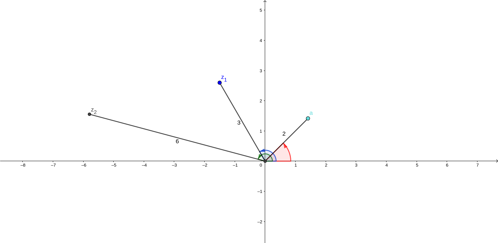

---
title: Les nombres complexes
date:
author: Delhomme Fabien
lang: fr
document: report
geometry:
  - margin=1in

...

\newcounter{question}
\stepcounter{question}

# Introduction

## Motivation

Les complexes, un des chapitres les plus compliqués à introduire peut-être. Pour
commencer, sachez que les complexes ont été d'abord appelés les _imaginaires_,
car on pensait qu'ils n'étaient pas _réels_[^fr].

[^fr]: comprenez réel au sens non mathématique du terme. On pourrait remplacer
  par « palpable »

Or, rien de plus faux. Les complexes sont présents, et incontournables dans de
nombreux domaines :

  - Physique (électronique, mécanique)
  - Ingénierie (conception de machine, étude de vibrations d'un véhicule par
      exemple une voiture etc)
  - Mathématiques (évidemment) : les complexes jouent un rôle plus que central,
      en géométrie, en algèbre et en analyse !
  - Informatique : nous verrons que les complexes servent à encoder les
      rotations, et donc par exemple de faire des rotations d'images
  - Et surement beaucoup d'autres.

Le grand paradoxe, c'est que pour découvrir les complexes, on passe
nécessairement par une incompréhension totale, devant des « nombres » qui
sortent de nulle part, etc. Ne vous inquiétez pas, vous verrez que contrairement
au nom, les complexes sont simples d'utilisations, voire même nous simplifie
grandement la vie !

## Portes d'entrées

Comme souvent en mathématiques, il existe plusieurs « portes d'entrée » pour
découvrir les complexes :

  - Les polynômes
  - La géométrie
  - Les matrices

Nous verrons dans ce cours les deux premiers, en insistant beaucoup sur le
premier. La relation avec les matrices sera peut-être expliquée dans le cours de
l'enseignement spécialisé.

Je vous propose donc d'entrer dans le monde des complexes par la grande porte :
les polynômes !

# Les nombres complexes : définition

## Soit $i$ un nombre tel que...

Nous avons vu dans le chapitre sur les polynômes, que certains d'entre eux
n'admettent pas de racine réelle. Rapellons qu'une racine désigne un nombre $x$
tel que $P(x) = 0$. Autrement dit, une racine d'un polynôme est un nombre qui
« annule » un polynôme. 

Prenons l'exemple le plus simple que l'on puisse imaginer : $$P(x) = x^2 +1$$.
Ce polynôme n'a effectivement pas de racine réelle puisque $x^2 \geq 0$ pour tout $x \in
\mathbb{R}$, et ainsi $x^2 +1 > 0$.

Mais imaginez un peu, (et vous comprenez peut-être pourquoi historiquement, les
premiers mathématiciens qui ont osé, étaient un peu fébriles à ce moment là), que
l'on _rajoute_ une racine à ce polynôme. C'est-à-dire que, puisque $P$ n'a pas
de racine, on va lui en _ajouter_ une !!
C'est-à-dire que l'on va _définir_ $i$ comme étant un nombre, tel que $i^2 =
-1$ (et donc $P(i) = 0$). Attention, $i$ n'est pas un nombre réel, vous l'aurez
bien compris !

Nous avons donc défini, ou plutôt imaginé, un nombre $i$ tel que :
  $$\boxed{i^2 = -1}$$

Remarquons alors dès à présent que notre polynôme de départ $P(x) = x^2+1$,
admet à présent deux racines (complexes donc). En effet, on a créé la première
avec $x = i$ mais on remarque, par analogie avec la multiplication que l'on
connait depuis la tendre enfance que :
  $$ (-i)^2 = (-1*i)^2 = (-1)^2*i^2 = 1*(-1) = -1$$
On a donc une autre racine de $P$ avec $x = -i$.

## Opérations dans les complexes

### Multiplier $i$ par un réel

Nous allons maintenant présenter les opérations possibles que l'on peut faire
avec ce nouveau nombre $i$.

Dans les calculs effectués plus haut, le nombre $i$ est considéré comme une
inconnue quelconque, et les règles de calculs sont les mêmes que les
manipulations effectuées pour résoudre une équation comme $3x + 2 = 3$.  On
définit donc naturellement la multiplication de $i$ par un réel quelconque $a \in
\mathbb{R}$ par le nombre (complexe) $a*i$ noté souvent $ai$.  Notez alors que
$ai = ia$, comme d'habitude.

Par exemple, si on veut multiplier $3$ par $i$, alors on écrit tout simplement
$3i$. Maintenant une petite question :

Question \thequestion \stepcounter{question}

: 	Vérifier que le polynôme $x^2 + 3$ n'admet pas de racine réelle. Donner
alors ses racines complexes. (_Indication_ Essayer de calculer $(3i)^2$, et
donnez l'autre racine par la même remarque que celle décrite au paragraphe
ci-dessus).

### Additionner avec $i$

On peut aussi définir une opération « plus » avec $i$ et un réel. Par exemple,
si on veut ajouter $4$ à $i$, alors on écrira $4+i$.

Allons un peu plus loin, que vaut :
  $$ z = 4+i + 3 - 2i$$
Premièrement, notre $4$ et notre $3$ sont des nombres réels, donc on sait les
additionner :
  $$ z = 7 + i - 2i$$
Maintenant, tout comme le traitement d'une inconnue «$x$» dans une équation, on
devrait pouvoir s'autoriser à factoriser par $i$ :
  $$ z = 7 + (1 - 2)i$$
On obtient finalement :
  $$ z = 7 - i$$

Remarquons alors que les deux opérations décrites peuvent être effectuées
simultanément, par analogie avec la « distribution » que l'on connait depuis le
collège. Par exemple, considérez l'expression complexe suivante :
  $$ z = (2 + 4i)*7$$
On distribue comme dans les réels :
  $$ z = 14 + 28i$$
Et on obtient le résultat !

Question \thequestion \stepcounter{question}

: 	Que vaut $(2 + 4i - 2 - 2i)*4$ ?

### Multiplions sans gênes avec des complexes !

Nous avons vu comment on pouvait multiplier un nombre $i$ par un nombre réel.
Maintenant, imaginons que nous ayons deux nombres $z_1 = 3 + 7i$ et $z_2 = -1 +
3i$. Est-ce qu'on peut définir $z_1 * z_2$ ? C'est-à-dire une multiplication
entre deux complexes quelconque ?
Essayons, et commençons par distribuer le produit, comme on sait le faire depuis
le collège, puis utilisons les règles vues plus haut pour simplifier
l'expression. On obtient alors successivement :
\begin{align*}
  z_1z_2  &= (3 + 7i)(-1 + 3i) \\
	  &= -3 + 9i -7i + (7i)*(3i)\\
	  &= -3 + 2i + (7*3)*(i*i)\\
	  &= -3 + 2i + 21*(-1)\\
  z_1z_1  &= -24 + 2i
\end{align*}

Vous avez vu ce qui s'est passé ? Le produit des deux nombres (complexes) $7i$
et $3i$ a redonné un nombre réel, qui s'est additionné ensuite avec le
nombre $-3$ !

Question \thequestion \stepcounter{question}

: 	Que vaut $(1-2i)(3-5i)$. Que vaut $( 5 - 4i)(5 + 4i)$. Des remarques
concernant ce dernier ?

Question \thequestion \stepcounter{question} 

: 	Soient deux complexes $z = a +ib$ et $w = c + id$. Exprimer $zw$ en
fonction de $a, b, c$ et $d$.

Question \thequestion \stepcounter{question}
: 	Est-ce que les identités remarquables vues (et connues ?) depuis le
collège fonctionnent avec des complexes ?

### Trouver les racines de n'importe quel polynôme de second degré.

Allons un peu plus loin, et tâchons de comprendre ce qui se passe pour les
autres polynômes de second degré. Par exemple, si on prend un autre polynôme qui
n'admet pas de racine réelle, est-ce que je peux, avec mon nouveau nombre $i$
lui trouver des racines complexes ? La réponse est **OUI**, et c'est un
véritable miracle !

Prenons un exemple. Soit $Q$ le polynôme $Q(x) = x^2 + x + 1$, vérifions que
ce polynôme n'admet pas de racines réelles.
  $$\Delta = 1^2 - 4*1*1 = -3$$
$\Delta$ est strictement négatif, ainsi les formules déjà connues ne marchent
plus, à cause de la racine carrée $\sqrt{\Delta}$ qui n'est pas définie sur les
nombres négatifs. Il faudrait donc, pour trouver les racines de mon polynôme,
pouvoir définir un nombre tel que son carré vaille $\Delta$. Hum, essayons
$\sqrt{ - \Delta}*i = \sqrt{3} * i$ (forcément, ce nombre ne peut pas être réel,
car aucun nombre réel ne peut, une fois élevé au carré, être négatif !).

Qu'est-ce que cela nous donne ?
  $$(\sqrt{3}*i)^2 = \sqrt{3}^2*i^2 = 3 * (-1) = -3 = \Delta$$
Nous avons trouvé une « racine carrée »[^attention] de $\Delta$ ! Donc je peux continuer les
formules que nous avons vues en cours, pour obtenir deux nouvelles racines,
complexes, de mon polynôme $Q$ :
\begin{align*}
  x_1 &= \frac{ 1 + i*\sqrt{3}}{2} \\
  x_2 &= \frac{ 1 - i*\sqrt{3}}{2}
\end{align*}
On peut même vérifier que $Q(x_1) = Q(x_2) = 0$ !

Question \thequestion \stepcounter{question} 

: 	Vérifier que $Q(x_1) = Q(x_2) = 0$.

Nous avons donc[^montrer] rajouté des racines à tous les polynômes !!!

[^attention]: Faites bien attention, on ne parle _jamais_ de racine d'un nombre
  négatif, et encore moins de la racine d'un nombre complexe. Nous avons
  _simplement_ remarqué que ce nombre complexe mis au carré, nous donnait le
  résultat souhaité, _c'est tout_. D'ailleurs, essayez de trouver un autre nombre
  qui aurait pu marcher, et regardez si vous trouvez les mêmes formules.

Question \thequestion \stepcounter{question}

: 	Pour un polynôme $az^2 + bz + c$ à discriminant strictement négatif,
quelles sont les formules qui nous donne les racines de ce polynôme, en vous
aidant de la discussion ci-dessus ?

[^montrer]: notez que nous l'avons réellement fait que pour un seul polynôme, et
  en particulier que pour un seul degré. Ceci ne constitue donc pas vraiment une « preuve ».
  Mais j'espère vous avoir donné l'intuition de ce résultat, hautement non
  trivial à démontrer (renseignez vous sur le théorème fondamentale de
  d'Alembert-Gauss).

## Définition du plan complexe

### Le plan complexe, et premières notions

L'addition et la multiplication de deux nombres complexes nous redonnent donc
toujours un nombre de la forme $a + ib$ avec $a$ et $b$ des nombres réels.
D'après les calculs effectués plus haut, on voit que les réels $a$ et les
nombres $ib$ avec $b \in \mathbb{R}$ ne se «mélangent» jamais. On pourra
interpréter cela géographiquement comme une sorte d'indépendance, si bien que
l'on a envie d'associer un complexe $z=a+ib$ avec un **point du plan** $(a,b)$.
On peut donc définir les complexes par :

  $$ \mathbb{C} = \{ a + bi \ | \ a, b \in \mathbb{R} \}$$

Pour un nombre complexe $z = a + i b$ avec $a,b$ qui sont des nombres réels, on
appelle :

  - $a$ la _partie réelle_ de $z$, on la note $\textrm{Re}(z)$
  - $b$ la _partie imaginaire_ de $z$, on la note $\textrm{Img}(z)$

Nous avons ainsi deux notions qui se dégagent :

  - Un nombre est réel si et seulement si sa partie imaginaire est nulle
  - Un nombre est dit _imaginaire pur_ si et seulement si sa partie réelle est
      nulle.

**Remarque** Les parties imaginaires et réelles sont _toujours_ des nombres
réels, faites bien attention à la définitions des parties réelles et
imaginaires (relisez-la).

Une notion très importante est la notion de _conjugué_ d'un complexe. Soit un
complexe $z$ de partie réelle $a$ et de partie imaginaire $b$. On définit alors
le _conjugué_ de $z$, qui est noté $\bar{z}$ par :
  $$\boxed{\overline{z} = \overline{a +ib } = a - ib }$$

Question \thequestion \stepcounter{question} 

: 	Relisez la définition d'une partie imaginaire et d'une partie réelle
d'un nombre complexe. Que vaut la partie imaginaire de $1 + 5i$ ?

Question \thequestion \stepcounter{question}

: 	Dans le plan complexe, que dire d'un point $z$ et de son conjugué
$\bar{z}$ (on attend une interprétation géométrique).

Question \thequestion \stepcounter{question}

: 	Quelle est la partie imaginaire du nombre $z\bar{z}$ ?

Question \thequestion \stepcounter{question}

: 	Quelles sont les parties réelle et imaginaire de $(2+i)(\sqrt{2} - 5i)$ ?

Question \thequestion \stepcounter{question}
: 	Si je me donne un nombre complexe $z$ de partie réelle $a$ et de partie
imaginaire $b$. Essayez d'exprimer $a$ en fonction de $z$ et $\bar{z}$
(Indication, que donne la somme $z + \bar{z}$ ?). Essayer d'exprimer $b$ en
fonction de $z$ et $\bar{z}$ (Indication, que donne la différence $z - \bar{z}$
?)

### Deux moyens de représenter les nombres complexes.

Au paragraphe précédent, nous avons montré pourquoi les complexes sont
représentés par des points du plan, avec deux coordonnées, la partie réelle et
la partie imaginaire. Mais comme tout point dans un plan munit d'un repère,
il admet deux représentations (deux moyens d'indiquer sa localisation).

  - Soit on lit les coordonnées par rapport au repère du point, et on sait ainsi
      ou se trouve le point.  Exemple : Dans mon plan complexe, mon repère est
      formé par les points $(0, 1, i)$, ainsi le nombre $3+2i$ admet 3 «pour
      abscisse» et 2 «pour ordonné» dans le plan.
  - Soit on donne la distance du point au centre du repère, et l'angle formé
      entre la droite qui passe par le point et le centre, avec l'abscisse.
      Exemple : Pour le point $3+2i$, d'après le théorème de Pythagore, la
      distance entre $3+2i$ et $0$ est $\sqrt{3^2 + 2^2} = \sqrt{13}$. Et on
      peut ensuite soit trouver graphiquement l'angle entre $3+2i$ et l'axe des
      abscisses, soit s'aider des fonctions trigonométriques pour trouver
      l'angle. Nous verrons comment faire en détail dans le chapitre qui suit
      (vous pouvez d'ores et déjà regarder la figure \ref{polaire}).

La deuxième manière de représenter un nombre complexe s'appelle la _forme
trigonométrique_ (puisque cette forme est définie à partir d'angle).

Le chapitre suivant nous introduira la notion d'exponentielle complexe, qui
montre la puissance de la représentation trigonométrique d'un complexe.

Question \thequestion \stepcounter{question}

: 	Placer dans le plan complexe $\cos{\dfrac{\pi}{3}} + i
\sin{\dfrac{\pi}{3}}$ et $5\left(\cos{\dfrac{\pi}{6}} + i
\sin{\dfrac{\pi}{6}}\right)$, $6\left( \cos{\dfrac {3\pi }{2}} +i\sin {\dfrac
{3\pi }{2}} \right)$. Calculer la distance de chacun de ces nombres avec le
centre.

### La forme trigonométrique

Si je reprends les remarques du paragraphe suivante, de la distance d'un point à
l'origine, et de l'angle que forme le point avec l'abscisse[^volontairement] 
ont des noms très précis :

  - La distance entre le point complexe $z$ et l'origine s'appelle la _norme_
      de $z$ et se note $|z|$.
  - L'angle formé avec l'axe des abscisses s'appelle _l'argument_ du nombre
      complexe, et se note $\textrm{arg}(z)$.

#### Calculer la norme d'un complexe

Pour calculer la norme d'un nombre complexe $z = a + ib$, rien de plus simple,
il suffit de calculer :
  $$ |z| = \sqrt{a^2 + b^2}$$

Question \thequestion \stepcounter{question}

: 	D'où vient cette formule ? Retrouver la à l'aide du théorème de
	Pythagore (et d'un dessin !)

Pour éviter de vous parachuter un résultat venu de nulle part, essayer
réellement de répondre à la question suivante :

Question \thequestion \stepcounter{question}

: 	Calculer $z*\overline{z}$, avec $z = a + ib$. (Je rappelle que
	$\overline{z}$ correspond au conjugué de $z$)

Donc, cette question vous permet de calculer la norme d'un nombre complexe d'une
autre manière (qui est en fait très utile lorsque l'on connait pas les
coordonnées d'un nombre complexes !) :

  $$ \boxed{ |z|^2 = z\overline{z}}$$

Question \thequestion \stepcounter{question}

: 	Dessiner l'ensemble des nombres complexes de module 1.

Question \thequestion \stepcounter{question}

: 	Quelle est la différence entre la norme d'un complexe et de son conjugué ?

#### Calculer l'argument d'un nombre complexe

Cette partie est plus délicate. Pour calculer l'argument d'un nombre complexe,
nous devons _d'abord_ calculer sa norme.

En effet, si je prend un point complexe $z = a + ib$ que je suppose non nul
(cela revient à dire que $\overline{z} \not = 0$[^pourquoi]), alors je peux faire cette
manipulation :
\begin{align*}
  z&=\left( a+ib\right) \\
  z&=\left| z\right|\left( \dfrac {a}{\left| z\right| }+i\dfrac {b}{\left| z\right| }\right)
\end{align*}

[^pourquoi]: pourquoi ?

Question \thequestion \stepcounter{question} 

: 	Montrer alors que $\left( \dfrac {a}{\left| z\right| }+i\dfrac
{b}{\left| z\right| }\right)$ est de norme 1.

Or, dans ce cas, puisque $\left( \dfrac {a}{\left| z\right| }\right) ^{2}+\left(
\dfrac {b}{\left| z\right| }\right)^{2}=1$, il existe un nombre $\theta$ (qui
sera l'argument de $z$ ), tel que :

\begin{displaymath}
  \begin{cases}
    \dfrac {a}{\left| z\right| }=\cos \left( \theta \right) \\
    \dfrac {b}{\left| z\right| }=\sin \left( \theta \right)
  \end{cases}
\end{displaymath}

Et ce nombre est unique si on demande $\theta \in [0, 2\pi[$, et cela donne
l'argrument de notre nombre complexe.

Question \thequestion \stepcounter{question} 

: 	Ce paragraphe est difficile, essayer de le comprendre avec un dessin. En
pratique, le jour du bac, il sera très simple de calculer l'argument d'un
nombre complexe.

#### Calculer la forme trigonométrique

Une fois que vous avez calculé la norme et l'argument d'un nombre complexe $z$,
vous pouvez alors donner sa[^unique] forme trigonométrique :
  $$ \boxed{z = |z|\left(\cos{(\theta)} +i\sin{(\theta)}\right)}$$
Très souvent on note $r=|z|$, pour ainsi écrire $z = r\left(\cos{(\theta)} +i\sin{(\theta)}\right)$

[^volontairement]: cette phrase est fausse écrite telle quelle, mais je ne
voulais pas préciser pour éviter de l'alourdir.

[^unique]: On dit donc « la » forme trigonométrique, puisqu'elle est unique.
Nous l'avons en fait prouvé, mais sans mettre le doigt sur les passages qui
mettent en évidence que deux nombres complexes de même forme trigonométrique,
où leur argument appartient à l'intervalle $[0, 2\pi[$, sont nécessairement
égaux.

# L'exponentielle complexe {#expocomplexe}

Certaines fonctions définies sur les réels (donc pas toutes, loin de là)
admettent une définition valide pour des nombres complexes. C'est le cas de
l'exponentielle.

## Définition formelle de l'exponentielle pour les complexes (hors programme)

Pour définir l'exponentielle sur les nombres complexes, nous avons vu la formule
suivante dans le cours de l'exponentielle (qui est complètement hors programme) :
  $$ \exp(z) = \sum_{k=0}^{+\infty} \frac{z^k}{k!}$$
En effet, nous savons comment multiplier et additionner les complexes, donc si
cette formule a bien un sens (ce que nous admettons) alors cette formule
fonctionne aussi avec les complexes.

Question \thequestion \stepcounter{question} (difficile)

: 	Pourquoi la définition à l'aide de l'équation différentielle de
l'exponentielle est plus délicate pour définir cette fonction dans les
complexes ?

## Définition au programme

L'exponentielle d'un nombre complexe $z = a + ib \in \mathbb{C}$, où $a
\in \mathbb{R}$ et $b \in \mathbb{R}$ est définie comme il suit :
  $$ \exp(z) = \exp(a + ib ) = \exp(a)*\exp(ib)$$
On essaie effectivement de conserver l'équation fonctionnelle de
l'exponentielle, pour l'étendre au complexe. Mais comment est donc
définie[^notdef] l'exponentielle d'un nombre imaginaire pur ? Et bien comme il
suit :
  $$\boxed{\exp(ib) = \cos(b) + i\sin(b)}$$
Cette formule s'appelle la _formule d'Euler_ !

[^notdef]: ce n'est pas une définition mais bien un théorème. Nous n'avons
  pas les moyens de le prouver, nous l'admettrons donc comme un fait.

Question \thequestion \stepcounter{question}

: 	Qui était Euler ? Dans quel domaine a-t-il travaillé ? À quelle époque vivait-il ?

### Formule divine

Voici une conséquence de la formule d'Euler . Si on prend $b = \pi$ dans la
formule vu plus haut, on obtient :
  $$\exp(i\pi) = \cos(\pi) + i\sin(\pi)$$
autrement dit, en passant $\cos{\pi} = -1$ de l'autre coté ($\sin{\pi} = 0$), nous obtenons :
  $$\boxed{e^{i\pi} +1 = 0}$$
Cette formule porte souvent le nom de « formule divine » car elle réunit à elle
seule toutes les stars des nombres en mathématiques, $i, \pi, 1, 0$, avec une
des fonctions les plus centrales, l'exponentielle !

## Conséquence de la formule d'Euler

Nous pouvons ainsi réécrire la forme trigonométrique d'un nombre complexe $z$ de
module $r$ et d'argument $\theta$ par :
  $$\boxed{ z = r*e^{i\theta}}$$
Cette notation s'appelle la _notation exponentielle_. Si vous avez trouvé la
forme trigonométrique d'un nombre complexe, alors il est très facile de donner
sa notation exponentielle.

### La multiplication entre deux complexes

Dans ce paragraphe, nous allons, grâce à la formule d'Euler, comprendre ce qu'il
se passe lorsque l'on multiplie deux complexes entre eux. En particulier, on va
regarder comment se comporte l'argument et le module du produit de deux nombres
complexes.

Supposons que l'on veuille regarder la multiplication du complexe $a \in
\mathbb{C}$ par le nombre $z \in \mathbb{C}$. On note alors $\theta_a$
l'argument de $a$, et $r_a$ le module de $a$. De même pour $z$. Alors, on
remarque que :
\begin{align*}
   z*a &= r_z * e^{i\theta_z}*r_a * e^{i\theta_a}\\
       &= r_z r_a e^{i(\theta_z + \theta_a)} \quad \text{Grâce à la formule
       d'Euler !}
\end{align*}

Donc, multiplier par $a$ par $z$ a eu pour effet vis à vis de $a$ de :

  - _multiplier_ son module par celui de $z$, autrement dit $|az|= |a||z|$
  - _ajouter_ à son argument celui de $z$, autrement dit $\textrm{arg}(a*z) =
      \textrm{arg}(a) + \textrm{arg}(z)$

Vous pouvez confirmer ces formules avec la figure \ref{produitcomplexe}.

Question \thequestion \stepcounter{question} 

: 	Je disais en introduction que les complexes permettent d'_encoder_ une
rotation d'angle quelconque. Détaillez ces propos, en essayant de trouver
comment appliquer une rotation de $\frac{\pi}{3}$ au nombre complexe $1+2i$ (qui
s'identifie au point du plan (1, 2)). (_Indication_ il faudra multiplier $1+2i$
par un nombre complexe bien choisi).

### Le quotient de deux nombres complexes

Il se passe un peu près la même chose pour le quotient, au vue des propriétés de
l'exponentielle, mais cette fois-ci, diviser un nombre complexe $a$ par $z$ a eu
pour effet vis à vis de $a$ de :

  - _diviser_ son module par celui de $z$, autrement dit $|\frac{a}{z}|=\frac{|a|}{|z|}$
  - _soustraire_ à son argument celui de $z$ autrement dit
      $\textrm{arg}(\frac{a}{z}) = \textrm{arg}(a) - \textrm{arg}(z)$

Question \thequestion \stepcounter{question}

: 	Complétez les calculs comme fait plus haut, mais cette fois-ci pour
$\frac{a}{z}$ et essayez de retrouver ces résultats.

Question \thequestion \stepcounter{question}

: 	On dirait bien que la fonction $\arg$ ressemble à une fonction réelle
que l'on connait déjà, mais laquelle ? Revenez quelque peu sur cette question,
et demandez vous pourquoi l'argument d'un nombre complexe n'est pas vraiment une
« fonction » (aidez vous d'un dessin). Cette remarque est à la base d'un des domaines
les plus riches en mathématiques, qui s'appelle _l'analyse
complexe_ (vue en troisième année de licence mathématique).

Encore plus fort, on peut utiliser à son plein potentiel la formule d'Euler pour
montrer que, quelque soit $n \in \mathbb{N}$ :
  $$\boxed{(\cos(\theta) + i\sin{\theta})^n = \cos{(n\theta) + i\sin{(n\theta)}}}$$
Cette formule a pour nom la formule de Moivre.

Question \thequestion \stepcounter{question} 

: 	Détaillez les calculs pour obtenir la formule de Moivre.

Question \thequestion \stepcounter{question}

: 	Développer $(\cos({\theta}) + i\sin{(\theta)})^2$ à l'aide d'une identité
remarquable. En utilisant la formule de Moivre, prouver alors que, quelque soit
$\theta \in \mathbb{R}$ :
  $$ \begin{cases}\cos ^{2}\left( \theta \right) =\dfrac {1+\cos \left( 2\theta
  \right) }{2}\\ \sin ^{2}\left( \theta \right) =\dfrac {1-\cos \left( 2\theta
  \right) }{2}\end{cases}$$

Question \thequestion \stepcounter{question} 

: 	Quelle est la période de la fonction $x \mapsto \cos{x}^2$ ?

### Calculer le conjugué d'un nombre complexe avec la notation exponentielle 

On peut maintenant voir le nombre conjugué d'un nombre complexe $z$ comme étant
le nombre complexe de même module, mais d'argument opposé !

Autrement dit, si $z = re^{i\theta}$, alors :
  $$\boxed{\overline{z} = re^{-i\theta}}$$

Question \thequestion \stepcounter{question} 

: 	Prouver cette formule détaillant les calculs, en passant par la forme
trigonométrique.

Question \thequestion \stepcounter{question}  

: 	Soit $z$ un nombre complexe de module 1. Alors, comparez, à l'aide de la
formule d'Euler, les nombres complexes $\frac{1}{z}$ et $\overline{z}$. Vous
pouvez aussi comparer ces deux nombres plus astucieusement en remarquant alors
que $z\overline{z} = 1$.

Question \thequestion \stepcounter{question}

: 	D'après l'équation fonctionnelle de l'exponentielle, on a
  $$ \exp{(a+b)} = \exp{a}\exp{b}$$
  Montrer alors, à l'aide de la formule d'Euler, que pour tout $a,b \in
  \mathbb{R}$ :
  $$ \cos{(a+b)} = \cos{(a)}\cos{(b)} - \sin{(a)}\sin{(b)}$$
  Trouver une formule similaire pour le sinus.

### Trouver des formules trigonométriques

Avec les questions plus haut, vous devriez avoir vu comment obtenir des formules
trigonométriques à l'aide de la formule d'Euler. Ici, je vais vous montrer
comment généraliser ce principe, en utilisant uniquement les notions que nous
avons déjà vues dans ce cours !

Rappelez vous que l'on peut utiliser $z$ et $\overline{z}$ pour calculer la
partie réelle et la partie imaginaire d'un nombre complexe. En effet, pour tout
$z \in \mathbb{C}$, on a :
$$
\begin{cases}
  \textrm{Re}\left( z\right) =\dfrac {z+\overline {z}}{2} \in \mathbb{R}\\ 
  \textrm{Im}\left( z\right) =\dfrac {z-\overline {z}}{2i} \in \mathbb{R}
\end{cases}
$$

Question \thequestion \stepcounter{question} 

: 	Redémontrez ces formules

En appliquant ces deux formules avec $z = e^{i\theta} = \cos{\theta} + i
\sin{\theta}$, avec évidemment (précisez...) $\textrm{Re}(z) = \cos{\theta}$ et
$\textrm{Im}(z) = \sin{\theta}$, on obtient alors, pour tout $\theta\in\mathbb{R}$ :
$$\begin{cases}
\cos \theta =\dfrac {e^{i\theta }+e^{-i\theta }}{2}\\
\sin \theta =\dfrac {e^{i\theta }-e^{-i\theta }}{2}
\end{cases}
$$

Ultime question de la mort \thequestion \stepcounter{question} 

: 	Essayer alors de simplifier l'expression de $\cos^3 \theta$, pour tout
$\theta \in \mathbb{R}$.
