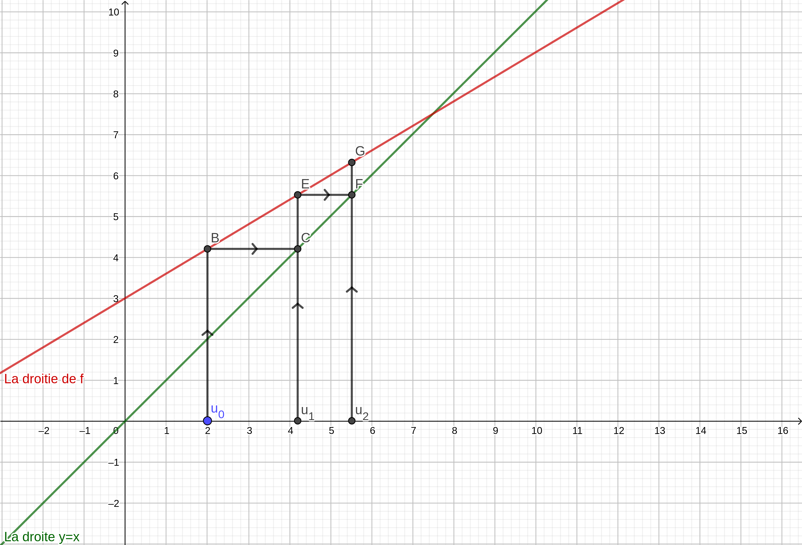

---
title: Les méthodes à connaître pour le bac sur les suites
date:
author: Delhomme Fabien
lang: fr

geometry:
  margin=1.2in
fontsize: 11pt
papersize: a4paper
document: report
classoption: twoside
colorlinks: blue
...

# Les différents types de suites

Il existe essentiellement que deux types de suite au bac en terminale S, et
trois si vous passez l'enseignement spécialisé.

  1. Suite définie pour tout rang $n$, par une fonction $f$ telle que
      $$u_n = f(n)$$
  2. Suite récurrence d'ordre un définie par une fonction $f$ telle que :
      $$ u_{n+1} = f(u_n)$$
  3. Suite récurrence d'ordre deux définie par une fonction $f$ telle que :
      $$ u_{n+2} = f(u_n, u_{n+1})$$

Il faut savoir que la fonction $f$ ne vaudra jamais n'importe quoi (car, en
toute généralité, il y a beaucoup de problème à gérer) :

  1. Dans le premier cas, $f$ sera soit un polynôme, soit un quotient de
     polynôme, soit des exponentielles ou des logarithmes dedans, plus rarement
     avec des racines. Dans tous les cas, $f$ sera dérivable sur une grande
     partie de $\mathbb{R}$ (il peut arriver qu'elle ne soit pas dérivable sur
     $0$ par exemple). Mais cela ne change pas grand chose à l'étude de notre
     suite, puisque nous cherchons à comprendre $f$ pour $n \in \mathbb{N}$.
  2. Dans le deuxième cas, nous avons :
     - Les suites arithmétiques : $f : x \mapsto x + r$ : où il faut savoir la formule explicite, la
	 somme, et les limites en fonction de la raison $r$
     - Les suites géométriques : idem, mais avec $f : x \mapsto q*x$
     - Les suites arithmético-géométrique, avec $f(x) = a*x +b$, et **très
	 souvent** $|a| < 1$, ce qui fait que la suite admettra une limite
	 lorsque $n \to \infty$.
  3. Dans le troisième cas, cela forcément une suite qui se ramènera par calcul
     matriciel au cas d'avant, je développerai dans un autre cours.

Le cas à détailler est donc le deuxième. Vous pouvez relire votre cours pour
retrouver les résultats suivants :

Suite arithmétique

:	C'est une suite définie par récurrence par $u_{n+1} = u_{n} + r$, avec
	$r \in \mathbb{R}$ la _raison_ de la suite $( u_{n} )$, et $u_0$ le
	_terme initiale_. Elle se calcule aussi grâce à la formule _explicite_
	$\boxed{u_{n} = u_0 + n*r}$. Un dernier résultat peut utiliser, mais à savoir
	tout de même est que :
	  $$\boxed{ \sum_{k = 1}^{n} k = \frac{n(n+1)}{2}}$$
	La limite d'une suite arithmétique est plus ou moins l'infini suivant le
	signe de la raison (voir la formule explicite).

Suite géométrique

: 	C'est une suite définie par récurrence par $u_{n+1} = u_{n}*q$, avec
	$q \in \mathbb{R}$ la _raison_ de la suite $( u_{n} )$, et $u_0$ le
	_terme initiale_. Elle se calcule aussi grâce à la formule _explicite_
	$\boxed{u_{n} = u_0*q^n}$. Un dernier résultat peut utiliser, mais à savoir
	tout de même est que :
	  $$\boxed{ \sum_{k = 1}^{n} q^k = \frac{1-q^{n+1}}{1-q}}$$
	La limite d'une suite géométrique est :

	  - 0 si $|q| < 1$
	  - $\infty$ si $|q| >1$

	Le cas $|q| = 1$ n'apparaissant jamais en pratique.

Suite arithmético-géométrique

: 	C'est une suite définie par récurrence par $u_{n+1} = q*u_{n} + r$, avec
	$q, r \in \mathbb{R}$. Il n'y a pas de formule explicite à connâitre
	(même si elle existe). La méthode pour la déterminer est précisée au
	dessous.

## Méthode pour traiter les suites arithmético-géométrique

Il faut savoir qu'il n'y a pas vraiment de résultat à connaître pour le bac,
tout vous sera rappeler. Seule la méthode sera importante à comprendre, et
savoir appliquer correctement. Les questions sont souvent très guidée, donc il
n'y a pas d'erreurs possibles. On peut voir ce type d'exercice apparaître avec
des probabilités, qui sont un cadre naturel pour explorer ce genre de suite.

Il faut bien comprendre que pour comparer une suite définie par récurrence à
l'aide d'une fonction (le deuxième cas donc), il faut _toujours_ comparer cette
fonction avec la droite $y=x$

  - Entrainer vous pour bien comprendre, à tracer, comme sur la figure
      \ref{trace}, les valeurs de la suite définie par récurrence ! C'est plus
      qu'instructif !
  - Essayer de comprendre quel rôle joue le point fixe (c'est à dire le point
      $x\in \mathbb{R}$ tel que $f(x) = x$)
  - Essayer de trouver le sens de variation de la suite, puis de le prouver par
      récurrence
  - Essayer de trouver un majorant de la suite, puis de montrer qu'elle
      converge.

{ width=10cm, height=10cm}

Ensuite, une fois que vous avez effectué toutes ces taches, vous avez fait le
plus dure ! Détaillons les étapes pour la suite arithmético-géométrique suivante :
  $$ u_{n+1}= 0.6 u_n + 3 \quad u_0 = 2 $$

Le graphique est donné par la figure \ref{trace}. Le point fixe ici est
clairement la limite de la suite, et on observe qu'elle est croissante. On voit
de plus assez rapidement que la suite est bornée par 2 et 8 (par exemple). Donc
on essaye de démontrer par récurrence le résultat suivant :
  $$ 2 \leq u_{n} \leq u_{n+1} \leq 8$$
Pour cela, l'initialisation est une simple constatation, et l'hérédité
fonctionne très bien grâce à la relation $u_{n+1} = f(u_{n})$, où $f : x \mapsto
0.6x + 3$, et par le fait que $f$ est croissante (car $0.6 > 0$).

Grâce à ce résultat, on obtient deux choses :

  - La suite est croissante
  - La suite est bornée

On en déduit par théorème de la _convergence monotone_, que la suite admet une
limite. On note $l$ la limite de cette suite.

On peut calculer cette limite, en effet, on a (et cela est vrai pour tout les
suites définies par $u_{n+1} = f(u_{n})$ qui admettent une limite en plus
l'infini, où $f$ est continue) :
  $$ \lim_{n \to \infty} u_{n+1} = \lim_{n \to \infty} u_{n} $$
Donc :
  $$ \lim_{n \to \infty} f(u_n) = l$$
Finalement :
  $$\boxed{f(l) = l}$$

Et ce résultat est tout le temps vrai : pour une suite définie par récurrence de
premier ordre, alors la limite de cette suite, si elle existe, est
nécessairement _un point fixe_ de $f$.

Ainsi, nous pouvons calculer dès à présent la limite de la suite $u_n$, par :
  $$ 0.6*l + 3 = l$$
D'où on trouve que $l = \frac{15}{2}$.

À partir de là, tout ce qui suit ne concerne uniquement les suites
arithmético-géométrique, mais le raisonnement se retrouve dans plusieurs autres
analyse de suite en mathématiques (pour ceux qui sont intéressés par les
mathématiques pour plus tard, sachez que derrière se cache le _théorème des
accroissements finis_, qui est en vérité très simple et très, très puissant !).

Donc, on pose à partir de ce moment, $w_n = u_{n} - l$. On obtient :
\begin{align*}
  w_{n+1} &= u_{n+1} - l \\
  w_{n+1} &= 0.6 u_{n} +3 - 0.6*l - 3 \quad \text{car} \quad l = 0.6l + 3\\
  w_{n+1} &= 0.6( u_{n} - l)\\
  w_{n+1} &= 0.6*w_n
\end{align*}

Donc, $(w_n)$ est une suite géométrique, de raison $q = 0.6$, donc tend vers $0$
puisque $|0.6| < 1$. Donc on en déduit que $u_n$ tend bien vers $l$ lorsque $n$
tend vers l'infini. Et de plus :
  $$w_n = w_0(0.6)^n$$
Donc, on obtient finalement une _formule explicite_ pour $(u_n)$ :
  $$u_n = w_0(0.6)^n + l$$

